# 📡 Real-Time Telemetry Pipeline — Streaming Sensor Data Quality, Drift & Cloud Analytics

[](https://github.com/theofanis-tsakanikas/realtime-telemetry-pipeline/actions/workflows/ci.yml)
[](./LICENSE)


<p align="center">
  
</p>

This project simulates a fleet of IoT environmental sensors and processes their telemetry **in real time**. Readings stream through **Apache Kafka** (Avro + Schema Registry), are validated and transformed by **Spark Structured Streaming**, and fan out to two sinks: **Redis TimeSeries** for low-latency live serving and **BigQuery** for analytics. **dbt** builds analytical marts on top of BigQuery, **Grafana** visualises the live data, and **statistical drift** raises a **Slack** alert the moment a sensor silently miscalibrates.

It runs two ways from a single codebase:

- 💻 **Locally** — the full **streaming** stack on **Docker Compose** (Kafka, Spark, Redis, Grafana, with the data-quality & drift observability), for development and the test suite. *The BigQuery + dbt analytics layer is cloud-only.*
- ☁️ **In the cloud** — a **cloud-native, fully keyless, 100% Infrastructure-as-Code** deployment on **GKE Autopilot**, provisioned with **Terraform** and shipped by **GitHub Actions** (one-button deploy, zero stored credentials).

> 🌍 This is the **GCP** half of a multi-cloud portfolio. Its companion, [`contract-driven-data-pipeline`](https://github.com/theofanis-tsakanikas/contract-driven-data-pipeline), applies the same keyless-OIDC philosophy on **AWS**.

---

## 📑 Table of Contents

- [Architecture](#-architecture)
- [What This Demonstrates](#-what-this-demonstrates)
- [Key Features](#-key-features)
- [The Live Pipeline](#-the-live-pipeline)
- [Data Engineering & Transformation (PySpark)](#-data-engineering--transformation-pyspark)
- [Analytics — BigQuery + dbt](#-analytics--bigquery--dbt)
- [Observability & Alerting](#-observability--alerting)
- [Cloud-Native Deployment (GCP)](#-cloud-native-deployment-gcp)
- [Local Development (Docker Compose)](#-local-development-docker-compose)
- [Project Structure](#-project-structure)
- [Tests & Code Quality](#-tests--code-quality)
- [Production Considerations](#-production-considerations)
- [License](#-license)

> For a deeper engineering reference — service ports, end-to-end data flow, test coverage, and known failure modes — see [CLAUDE.md](./CLAUDE.md).

---

## 🏗️ Architecture

The banner above is the visual overview. In data-flow terms:

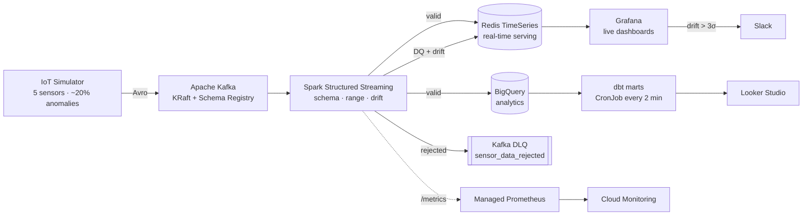
```mermaid
flowchart LR
  SIM["IoT Simulator<br/>5 sensors · ~20% anomalies"] -->|Avro| K["Apache Kafka<br/>KRaft + Schema Registry"]
  K --> SP["Spark Structured Streaming<br/>schema · range · drift"]
  SP -->|valid| R[("Redis TimeSeries<br/>real-time serving")]
  SP -->|valid| BQ[("BigQuery<br/>analytics")]
  SP -->|rejected| DLQ[["Kafka DLQ<br/>sensor_data_rejected"]]
  SP -->|DQ + drift| R
  R --> G["Grafana<br/>live dashboards"]
  BQ --> DBT["dbt marts<br/>CronJob every 2 min"]
  DBT --> LS["Looker Studio"]
  SP -. /metrics .-> GMP["Managed Prometheus"] --> CM["Cloud Monitoring"]
  G -->|"drift > 3σ"| SLACK["Slack"]
```

A single declared data contract ([`scripts/metrics_spec.py`](scripts/metrics_spec.py)) is the source of truth for validation, the dead-letter routing, **and** the drift baselines — the same ranges guard every stage of the pipeline.

---

## 🎯 What This Demonstrates

This is a portfolio project built to demonstrate **end-to-end, cloud-native data engineering** across a modern streaming + analytics stack:

- **Streaming architecture:** A decoupled producer → broker → stream-processor → store → dashboard pipeline where each stage scales independently, with **Avro on the wire** governed by a **Schema Registry**.
- **Stateful stream processing:** Spark Structured Streaming with micro-batches, checkpointing for fault tolerance, and a connection-per-partition Redis sink pattern.
- **Dual-sink design:** The same validated stream lands in **Redis** (hot path, sub-second serving) and **BigQuery** (cold path, analytics) — the classic serving/analytics split.
- **Data quality engineering:** A declared contract is the single source of truth; bad readings are quarantined to a **dead-letter topic** with a reason, and per-batch quality metrics (accept rate, rejections by reason) are published live — you can *see* data quality, not just trust it.
- **Statistical drift detection:** Beyond the range filter, each micro-batch's per-metric mean is z-tested against its commissioning baseline. This catches a sensor reading 5 °C high **even though every reading is still in valid range** — silent drift a threshold filter can't see — and fires a **3σ Slack alert**.
- **Analytics modelling:** **dbt** turns the raw BigQuery landing tables into clean, tested **marts** (per-minute aggregates), refreshed on a schedule in-cluster.
- **Cloud-native & keyless:** Runs on **GKE Autopilot**, **100% Terraform**, deployed by **GitHub Actions** with **Workload Identity Federation** — no service-account keys anywhere. Pods authenticate to Google APIs via **Workload Identity**; kubectl reaches a **private** control plane via **Connect Gateway**.
- **Production-minded tooling:** Managed Prometheus metrics, provisioned Grafana alerting, automated linting + tests in CI, and a two-layer Terraform design (persistent foundation vs. ephemeral app).

---

## 🚀 Key Features

* **IoT Simulation:** Python simulator generating temperature, humidity, and pressure for 5 sensors, with a deliberate ~20% anomaly rate to exercise the cleaning logic.
* **Schema-governed messaging:** Apache Kafka (single-node KRaft, no Zookeeper) with **Avro** payloads and a **Confluent Schema Registry**.
* **Real-time processing:** Spark Structured Streaming for stateful, checkpointed time-series transformations.
* **Data validation & DLQ:** Range + regex + schema checks; rejected rows routed to a dead-letter topic tagged with a `rejection_reason`.
* **Dual storage:** Redis TimeSeries for live serving **and** BigQuery for analytics, written from the same job.
* **Analytics marts:** dbt staging + marts on BigQuery, refreshed every 2 minutes by a Kubernetes CronJob.
* **Live observability:** Per-batch data-quality + drift metrics on a dedicated Grafana row, plus Spark JVM/throughput metrics via Managed Prometheus.
* **Drift alerting:** Provisioned Grafana alert rules push a Slack notification when any metric drifts beyond 3σ.
* **Two deployment targets:** the same application code and container images run locally via Docker Compose and in the cloud on GKE Autopilot (Kubernetes manifests).

---

## 📺 The Live Pipeline

A walk through the running stack, stage by stage.

### 1. Kafka — schema-governed ingestion
Avro-encoded sensor readings land on the `sensor_data` topic, browsable in Kafka-UI (note the `SchemaRegistry` value serde).

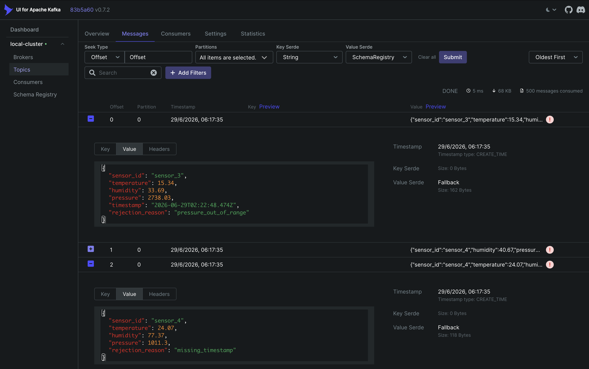

Their structure is governed by the registered Avro schema (`SensorReading`) in the Schema Registry:

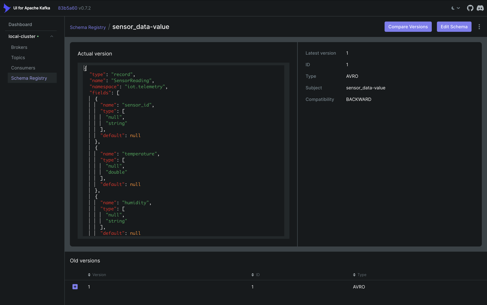

Readings that fail validation aren't dropped — they're quarantined to the `sensor_data_rejected` dead-letter topic, each tagged with its `rejection_reason`:


### 2. Spark — Structured Streaming
The Spark UI's **Structured Streaming** tab — the active streaming queries processing micro-batches from Kafka, with their input/processing rates and latest batch IDs.

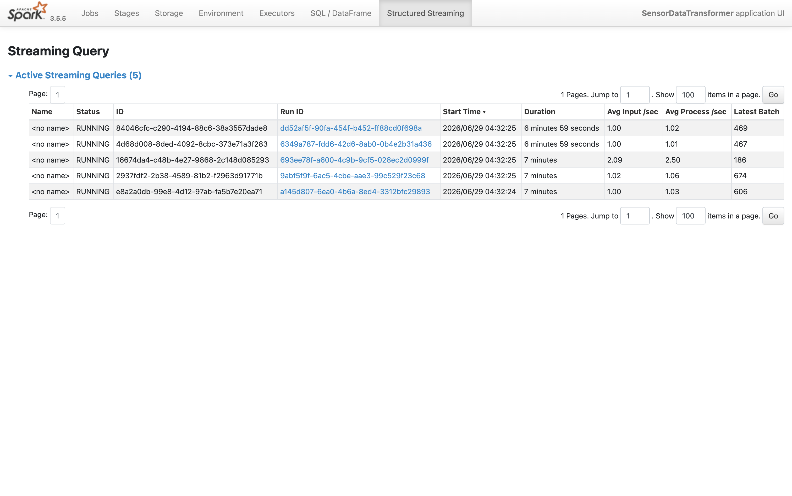

### 3. Redis TimeSeries — the hot path
`TS.MRANGE` across all 5 sensors' temperature, charted in RedisInsight — the low-latency serving store Grafana reads from.

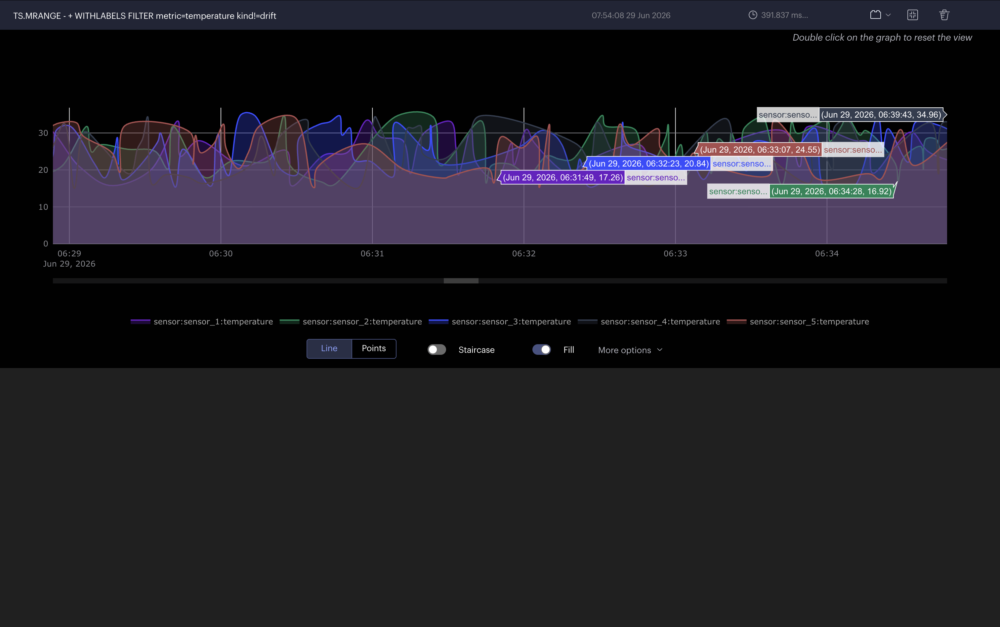

Underneath: 15 labelled sensor series (5 sensors × 3 metrics) alongside the `dq:*` and `drift:*` observability series the job publishes each batch.

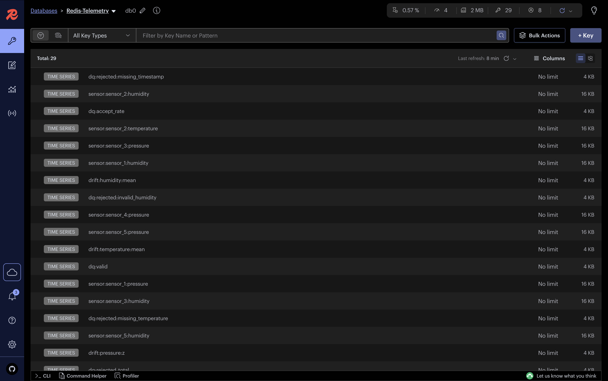

### 4. Grafana — live sensor dashboard
All-sensors temperature and humidity, plus **Sensor 1**'s live gauges (current temperature/humidity) and pressure trend — auto-refreshing every 5 seconds.

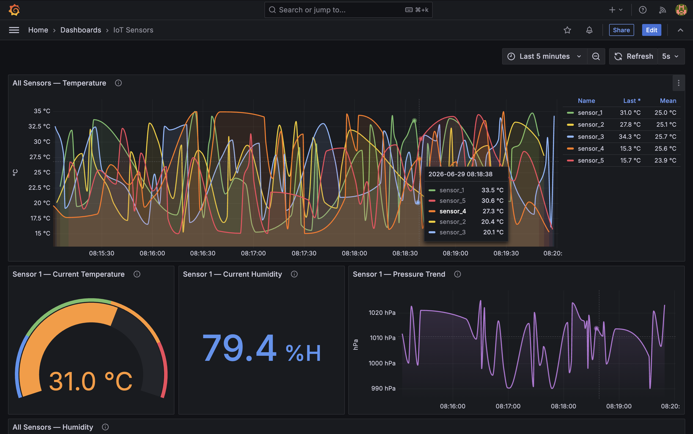

---

## 🛠️ Data Engineering & Transformation (PySpark)

The core is the Spark Structured Streaming job ([`scripts/spark_transform.py`](scripts/spark_transform.py)). Instead of blindly moving data, it applies enterprise-grade practices:

* **Schema enforcement & Avro:** Payloads are deserialized against a registered Avro schema (Schema Registry); types are fixed at the edge.
* **Regex data cleaning:** Messy string fields (e.g. humidity) are validated via regex before casting to double.
* **Range outlier filtering:** Drops nulls and out-of-range hardware readings — Temperature 10–45 °C, Humidity 0–100 %, Pressure 950–1050 hPa.
* **Native Redis TimeSeries sink:** `.foreachPartition()` opens one pipelined connection per Spark partition and pushes metrics via native `TS.ADD` — no ORM overhead.
* **BigQuery analytics sink:** A best-effort `foreachBatch` write lands every valid micro-batch in BigQuery (the analytics cold path). Errors are logged, never raised — analytics can't take down ingestion.
* **Dead-letter queue:** Rows that fail validation are routed to `sensor_data_rejected` tagged with a `rejection_reason` (`invalid_humidity`, `pressure_out_of_range`, …) — inspectable, not silently dropped.
* **Live data-quality & drift:** A third sink publishes per-batch accept rate, rejections by reason, and per-metric drift z-scores to Redis, surfaced on a dedicated Grafana **Data Quality & Drift** row with a 3σ alert band.

---

## 📈 Analytics — BigQuery + dbt

The streaming job lands two raw tables in BigQuery (`telemetry.readings`, `telemetry.rejections`, day-partitioned with a 30-day expiry). **dbt** ([`dbt/`](dbt/)) turns them into clean, tested marts:

| Layer | Models |
|---|---|
| **Staging** | `stg_readings`, `stg_rejections` — typed, renamed views over the raw landing tables |
| **Marts** | `sensor_minutely` (per-sensor/min aggregates), `accept_rate_minutely`, `rejections_by_reason`, `reading_volume` |

In the cloud, a Kubernetes **CronJob runs `dbt build` every 2 minutes**, so the marts track the live stream; **Looker Studio** sits on top for BI-style exploration. The same models also run from your laptop via `make dbt-build` — dbt-bigquery targets BigQuery, so it needs GCP credentials (there's no local warehouse).

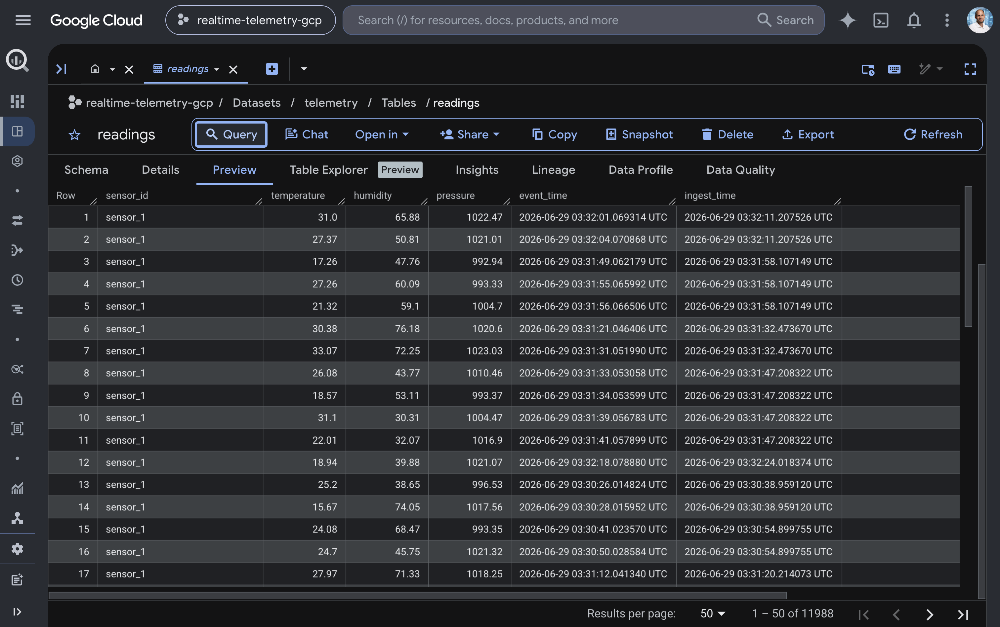

---

## 🔔 Observability & Alerting

Observability is treated as a first-class output of the pipeline, not an afterthought.

**Data quality & drift (business-level).** Every micro-batch publishes its accept rate, rejection breakdown, and per-metric drift z-score to Redis, rendered on a dedicated Grafana row. The drift z-test compares each batch mean to the commissioning baseline — the thing a range filter is blind to.

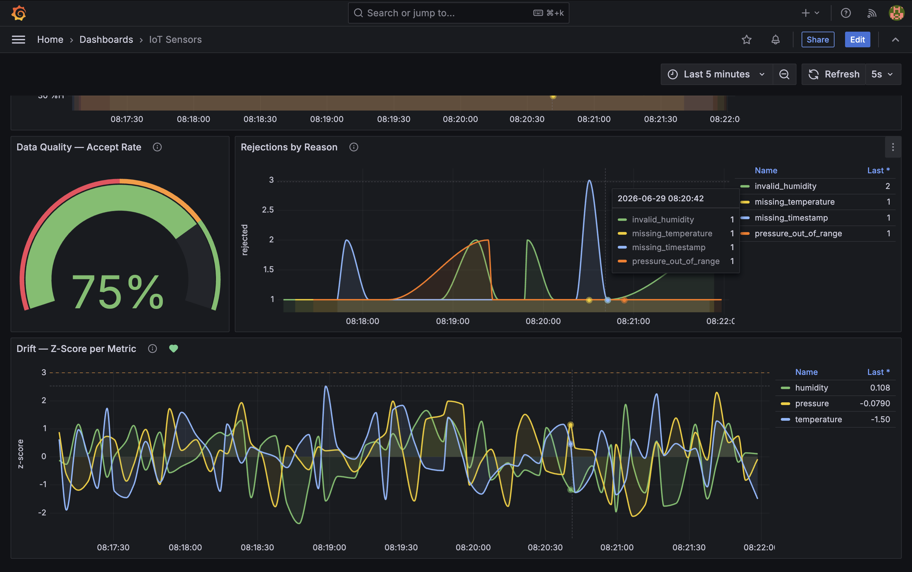

**Spark internals (system-level).** The Spark driver exposes Prometheus metrics; in the cloud **GKE Managed Service for Prometheus (GMP)** scrapes them into **Cloud Monitoring**, where streaming throughput, micro-batch latency, and JVM heap/GC are queryable. (Locally, a self-hosted Prometheus backs the same Grafana **Pipeline Health** dashboard.)

**Drift → Slack.** Grafana alerting is fully provisioned ([`infra/grafana/provisioning/alerting/`](infra/grafana/provisioning/alerting/)): when any metric drifts past **3σ**, the rule fires and posts to Slack — with a matching **resolved** message when it clears.

| Alert fires in Grafana | Notification in Slack |
|---|---|
| 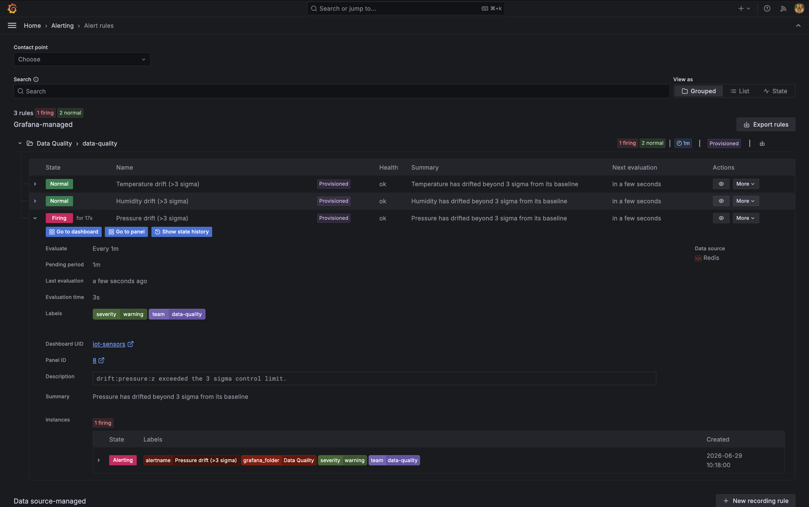 | 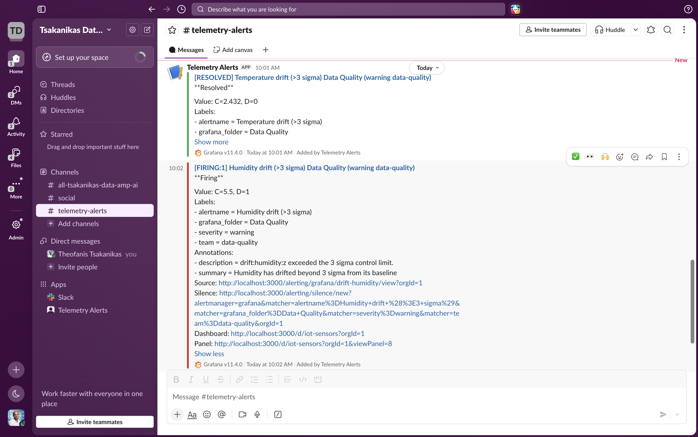 |

---

## ☁️ Cloud-Native Deployment (GCP)

The whole stack deploys to **GCP as a cloud-native application** — **GKE Autopilot**, provisioned with **Terraform** and shipped by **GitHub Actions**, with **no service-account keys anywhere**.

It's designed to be **ephemeral**: deploy for a demo, then tear the app layer down. The persistent foundation (identity, secrets, registry, BigQuery) costs ~cents idle; the GKE workloads are the only real spend, and one action destroys them.

### Design — two Terraform layers

| Layer | Lifecycle | Provisions |
|---|---|---|
| **`foundation/`** | Run **once** by the owner (`make bootstrap`); persists | Workload Identity Federation, deployer + runtime service accounts, Secret Manager (values seeded from `.env`), Artifact Registry, **BigQuery** dataset + tables, monitoring |
| **`app/`** | Routine, **CI- or CLI-deployable**; ephemeral | VPC + Cloud NAT, **GKE Autopilot** (private control plane), fleet membership, the pod-level Workload Identity binding |

**Keyless everywhere:** GitHub Actions authenticates to GCP via **Workload Identity Federation** (OIDC, locked to this repo). Pods authenticate to Google APIs (BigQuery, Secret Manager) via **Workload Identity**. `kubectl` reaches the **private** GKE control plane through **Connect Gateway** — no bastion, no public endpoint, no keys.

### Step 1 — `make bootstrap` (owner, once)

Applies the foundation and seeds secret **values** from your local `.env` into Secret Manager — a single command for the whole identity + secrets + registry + BigQuery base.

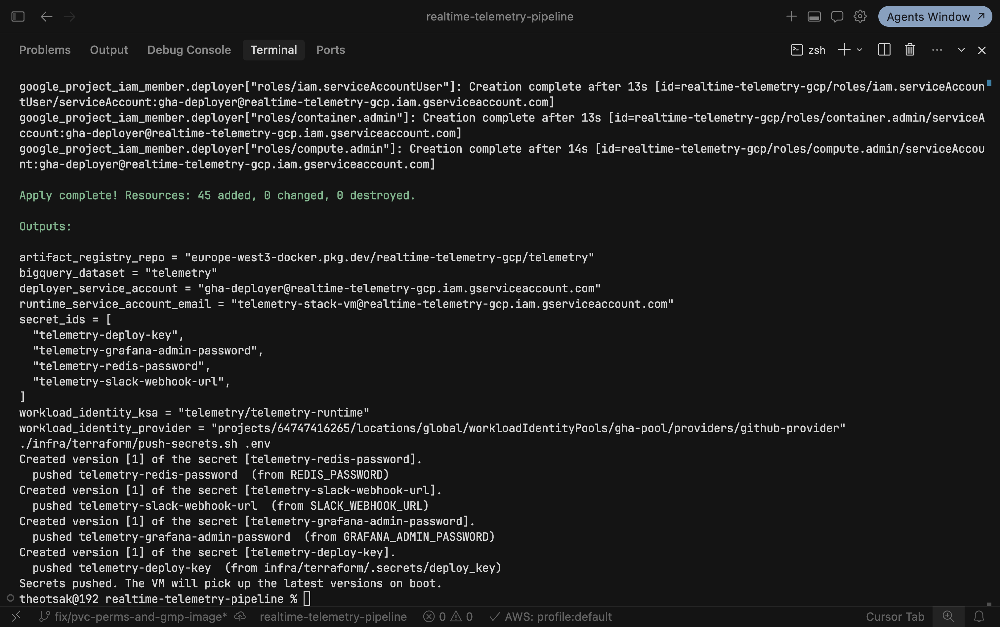

### Step 2 — Build & push images (CI, on push)

The **build-images** workflow builds the simulator, Spark, and dbt images and pushes them to Artifact Registry on every relevant push (tagged `:sha` and `:latest`).

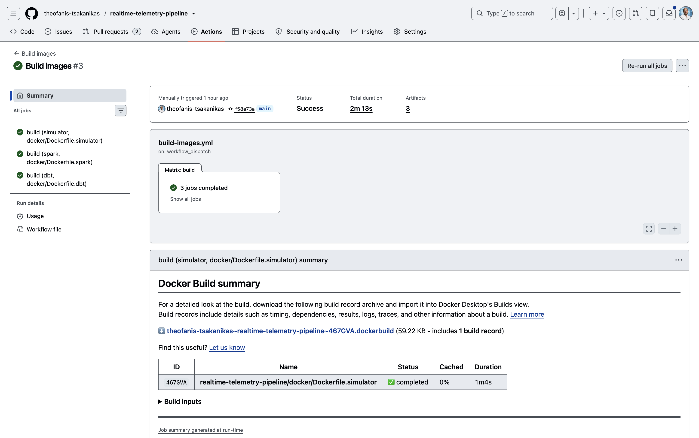

### Step 3 — One-button deploy (CI)

The **Terraform** workflow (`workflow_dispatch`) runs `terraform apply` on the app layer, then deploys the Kubernetes manifests via Connect Gateway — the entire cloud stack from one button.

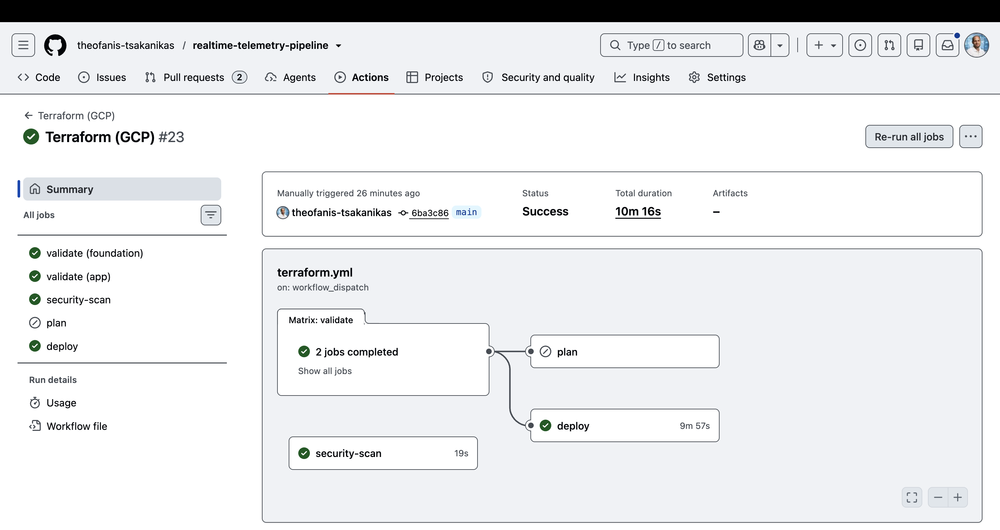

The result: the full pipeline running as pods on GKE Autopilot…

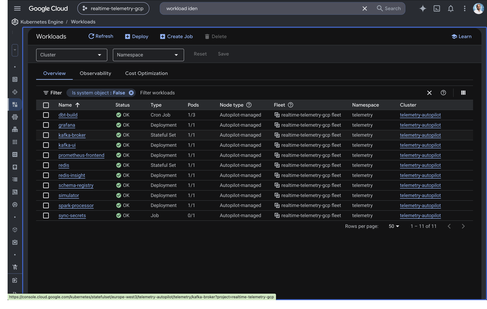

…on a private Autopilot cluster:

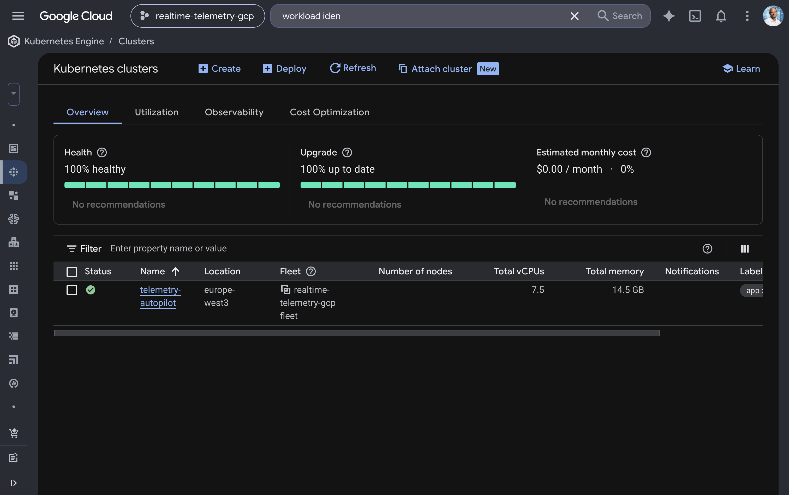

### The GCP footprint

<table>
  <tr>
    <td align="center">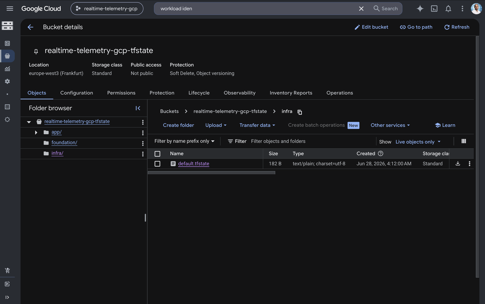<br><sub>GCS — Terraform remote state</sub></td>
    <td align="center">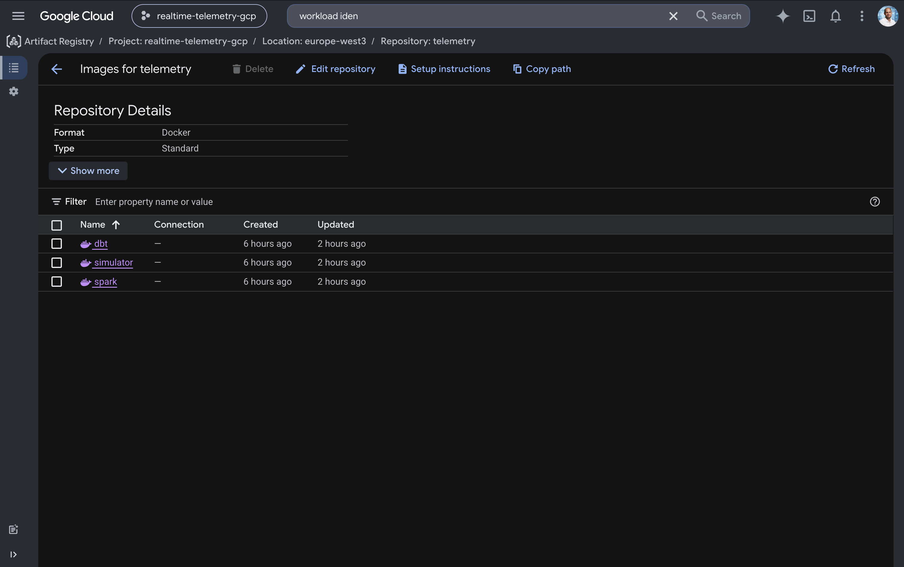<br><sub>Artifact Registry — images</sub></td>
  </tr>
  <tr>
    <td align="center">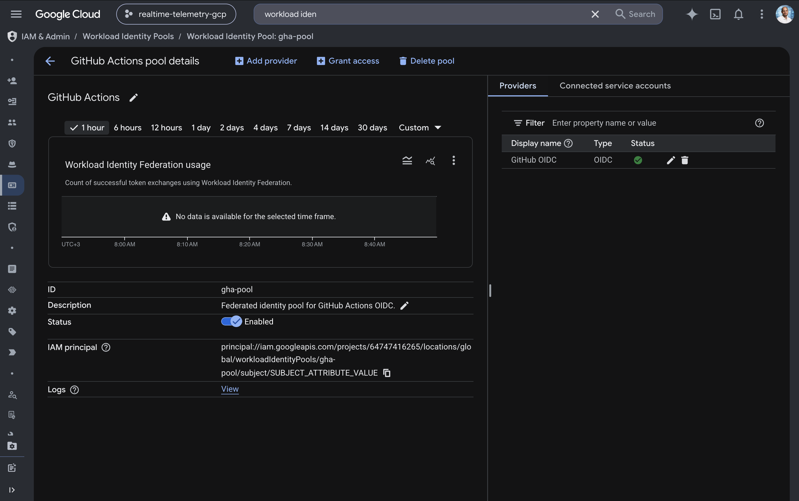<br><sub>Workload Identity Federation (keyless CI)</sub></td>
    <td align="center">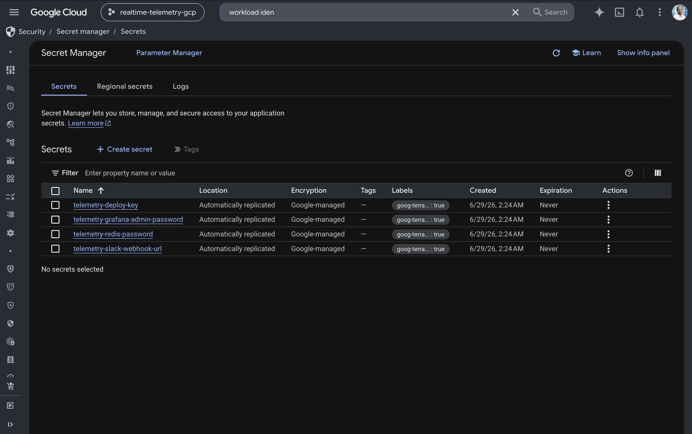<br><sub>Secret Manager</sub></td>
  </tr>
  <tr>
    <td align="center">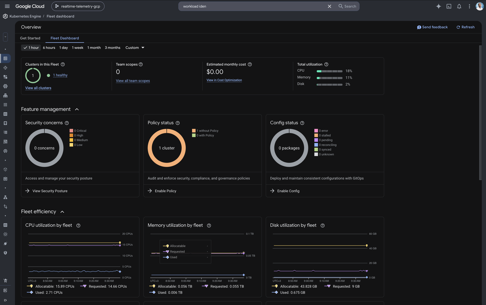<br><sub>GKE Fleet dashboard — 1 cluster, healthy</sub></td>
    <td align="center">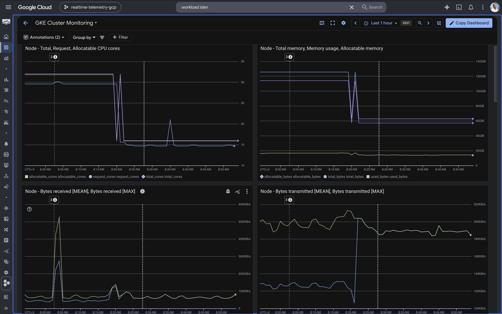<br><sub>Cloud Monitoring (GMP) dashboards</sub></td>
  </tr>
</table>

### Lifecycle (Makefile front door)

```bash
make bootstrap     # ONE-TIME: foundation apply + seed secrets from .env (owner)
make k8s-images    # build + push simulator / spark / dbt images to Artifact Registry
make cloud-up      # terraform apply the app layer (VPC + NAT + GKE Autopilot)
make k8s-kubeconfig# point kubectl at the private cluster via Connect Gateway
make k8s-apply     # deploy the Kubernetes manifests
make cloud-down    # destroy the app layer (foundation + BigQuery + secrets persist) → ~$0
```

> Routine deploys/destroys also run from the **GitHub Actions** UI (keyless), so you never need credentials on your laptop. See [`infra/terraform/README.md`](infra/terraform/README.md).

---

## 💻 Local Development (Docker Compose)

The full **streaming** stack also runs locally — ideal for development and to run the test suite without any cloud. (The BigQuery + dbt analytics layer is cloud-only — it targets managed BigQuery.)

```bash
# 1. One-time setup: venv, deps, data dirs, and a .env from the template
chmod +x setup.sh run.sh
./setup.sh

# 2. Build the custom simulator + Spark images
make build          # or: ./run.sh build

# 3. Start the full stack (Kafka, Spark, Redis, Grafana, Kafka-UI, RedisInsight)
make start          # or: ./run.sh up

# 4. Verify, stream logs, tear down
make ps             # container statuses
make logs           # live logs (Ctrl+C detaches)
make stop           # stop + remove containers
```

Then open **Grafana** at `http://localhost:3000` (login `admin` / `GRAFANA_ADMIN_PASSWORD`, default `admin`) — the Redis datasource and dashboards are auto-provisioned. Full service URLs/ports are in [CLAUDE.md](./CLAUDE.md).

> Configuration is injected at runtime via docker-compose `environment:` blocks — the `.env` file is only used when running the Python scripts locally on the host.

---

## 📂 Project Structure

```text
realtime-telemetry-pipeline/
├── .github/workflows/        # CI (ruff + pytest), build-images, terraform deploy, gitleaks
├── app/                      # Streamlit "Sensor Wall" — standalone deployable
├── dbt/                      # dbt project: staging views + BigQuery marts (+ tests)
│   └── models/
│       ├── staging/          # stg_readings, stg_rejections
│       └── marts/            # sensor_minutely, accept_rate_minutely, rejections_by_reason, reading_volume
├── docker/
│   ├── Dockerfile.simulator  # Python sensor simulator
│   ├── Dockerfile.spark      # PySpark job (+ Kafka/Avro/BigQuery connectors)
│   └── Dockerfile.dbt        # dbt-bigquery runner (the CronJob image)
├── infra/
│   ├── docker-compose.yml    # Local stack (Kafka in KRaft mode)
│   ├── grafana/              # Provisioned datasource, dashboards, and Slack alerting
│   ├── k8s/base/             # Kustomize manifests for the whole GKE stack
│   └── terraform/
│       ├── foundation/       # Persistent: WIF, SAs, secrets, Artifact Registry, BigQuery
│       └── app/              # Ephemeral: VPC, NAT, GKE Autopilot, fleet, WI binding
├── scripts/
│   ├── sensor_simulator.py   # Kafka producer; ~20% deliberate anomalies
│   ├── metrics_spec.py       # Data contract: valid ranges + drift baselines (single source of truth)
│   ├── data_quality.py       # Per-batch DQ metrics → Redis TS
│   ├── drift.py              # Statistical drift (z-test vs baseline) → Redis TS
│   └── spark_transform.py    # Spark job: valid → Redis + BigQuery, rejected → DLQ, DQ/drift → Redis
├── tests/                    # Pytest suite (clean/rejected data, DQ, drift, Redis sink, simulator, app)
├── Makefile                  # Task runner: local stack, tests, dbt, k8s, and cloud lifecycle
├── run.sh / setup.sh         # Docker Compose wrapper + one-time local setup
└── requirements*.txt         # Runtime + dev dependencies
```

---

## 🧪 Tests & Code Quality

The transformation and observability logic is unit-tested in isolation — **no Kafka, Redis, Spark cluster, or Docker required**. Tests run against a local `SparkSession` (session-scoped fixture) and a mocked Redis client, so the suite is fast and CI-friendly.

```bash
source .venv/bin/activate     # created by ./setup.sh

make test        # pytest — full suite
make coverage    # pytest with a coverage report (terminal + htmlcov/)
make lint        # ruff check scripts/ tests/ app/
```

What's covered:

| Area | Tests |
|---|---|
| `clean_data()` | range/boundary filtering, regex humidity casting, schema/type enforcement via `from_json` |
| `rejected_data()` | every rejection reason; valid + rejected exactly partition the input |
| Data quality | per-batch accept rate and rejection breakdown (`data_quality.py`) |
| Drift | z-score vs baseline, alert threshold, empty/degenerate batches (`drift.py`) |
| Redis sink | key scheme, ms conversion, idempotent `TS.ADD` args (mocked client) |
| Simulator | message schema, ~20% anomaly rate per type, deterministic-by-seed output |
| Streamlit app | demo synthesis, banding, pivots, and a **contract-drift guard** asserting the app's ranges still match `metrics_spec.py` |

CI ([.github/workflows/ci.yml](./.github/workflows/ci.yml)) runs the lint and the full suite (with coverage) on every push and pull request. The same `ruff` check is available as an optional pre-commit hook ([.pre-commit-config.yaml](./.pre-commit-config.yaml)).

---

## 🏭 Production Considerations

This is a **portfolio project**, but it deliberately closes most of the gap between a demo and production by deploying cloud-native. The honest state of each concern:

| Concern | This project | Further hardening for production |
|---|---|---|
| **Orchestration** | GKE **Autopilot** — Google manages nodes; pods request CPU/memory directly. | Multi-zone node pools, PodDisruptionBudgets, HPA on the stream processor. |
| **Identity & secrets** | **Keyless** end-to-end — WIF for CI, Workload Identity for pods, secrets in **Secret Manager** (never in git/tfstate). | Add per-environment projects, secret rotation, and least-privilege audits. |
| **High availability** | Single Kafka broker (KRaft, `replication-factor=1`); Spark single driver. | ≥3 brokers, `replication-factor=3`, `min.insync.replicas=2`; Spark on multiple executors (or Dataproc). |
| **Network** | **Private** GKE control plane (Connect Gateway only), Cloud NAT for egress, no public ingress. | Authorized networks per environment, mTLS between services, NetworkPolicies. |
| **Analytics** | BigQuery landing tables + dbt marts, day-partitioned with expiry; CronJob refresh. | Incremental models, partition pruning at scale, dbt CI checks on marts. |
| **Data source** | A simulator emits synthetic readings (~20% anomalies by design). | Real device telemetry (MQTT bridge / Kafka Connect) — same contract, cleaning, and observability. |

The transformation, data-quality, drift, contract, and IaC logic are written to be production-grade already — what changes for production is mostly **scale and redundancy of the infrastructure**, not the pipeline code.

---

## 📜 License

This project is licensed under the [MIT License](./LICENSE).
