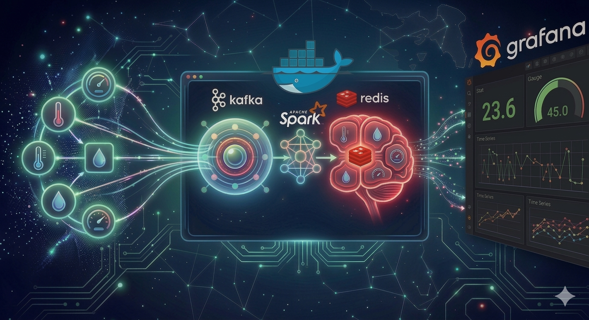
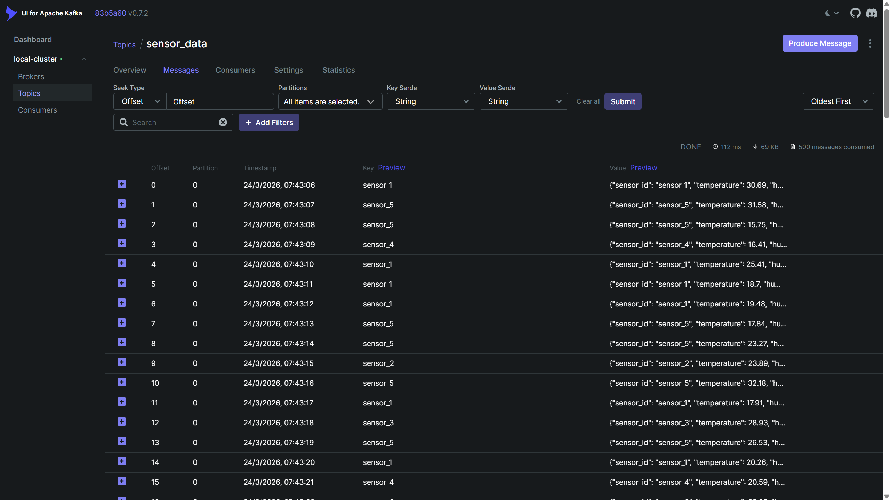
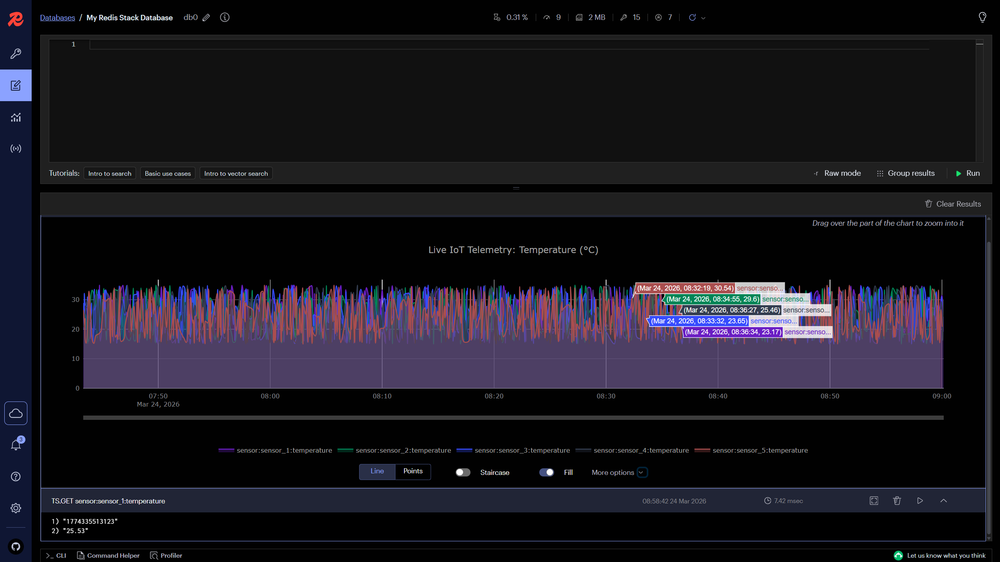
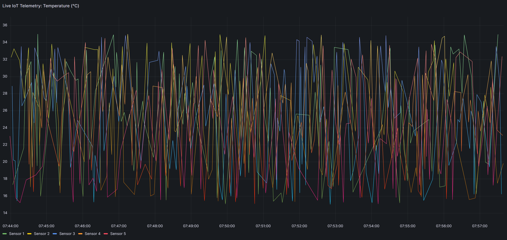
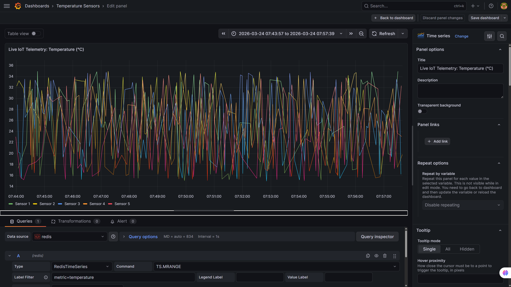
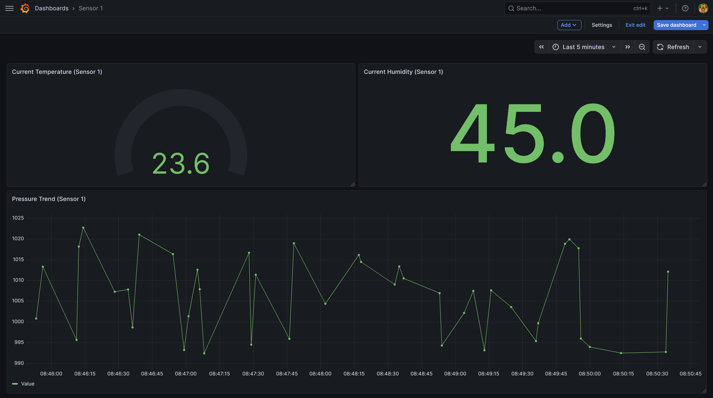

<div style="background-color:#fff8e7; color:#2b2b2b; padding:20px; border-radius:10px;">

# 📡 Real-Time IoT Data Pipeline: Kafka ➔ Spark ➔ Redis ➔ Grafana

[](https://github.com/theofanis-tsakanikas/kafka-spark-redis-streaming-etl/actions/workflows/ci.yml)
[](./LICENSE)




This project demonstrates a robust, scalable real-time IoT data processing pipeline. It simulates data from multiple environmental sensors, streams it through `Apache Kafka`, processes it using `Apache Spark` Structured Streaming, stores time-series data in `Redis`, and visualizes live insights via `Grafana` dashboards.

The entire infrastructure is containerized using `Docker` and managed with convenient shell scripts.

---

## 📑 Table of Contents

- [What This Demonstrates](#-what-this-demonstrates)
- [Key Features](#-key-features)
- [Data Engineering & Transformation (PySpark)](#-data-engineering--transformation-pyspark)
- [Infrastructure Ecosystem (Docker Compose)](#-infrastructure-ecosystem-docker-compose)
- [CLI Automation Wrapper (run.sh)](#-cli-automation-wrapper-runsh)
- [Project Structure](#-project-structure)
- [Quick Start Guide](#-quick-start-guide)
- [Tests & Code Quality](#-tests--code-quality)
- [Data Validation & Verification](#-data-validation--verification)
- [Grafana Visualization Dashboards](#-grafana-visualization-dashboards)
- [Project Shutdown](#-project-shutdown)
- [Production Considerations](#-production-considerations)
- [License](#-license)

> For a deeper engineering reference — service ports, end-to-end data flow, test coverage, and known failure modes — see [CLAUDE.md](./CLAUDE.md).

---

## 🎯 What This Demonstrates

This is a portfolio project built to demonstrate end-to-end **real-time data engineering** skills across a modern streaming stack:

- **Streaming architecture:** Designing a decoupled producer → broker → stream-processor → store → dashboard pipeline, where each stage scales independently.
- **Stateful stream processing:** Using Spark Structured Streaming with micro-batches, checkpointing for fault tolerance, and a connection-per-partition sink pattern.
- **Data quality engineering:** A declared sensor data contract (`metrics_spec.py`) is the single source of truth for validation; bad readings are quarantined to a dead-letter topic with a reason, and per-batch quality metrics (accept rate, rejections by reason) are published live to the dashboard — you can *see* the data quality, not just trust it.
- **Statistical drift detection:** Beyond the range filter, each micro-batch's per-metric mean is compared to its commissioning baseline with a z-test (`drift.py`). This catches a miscalibrated sensor reading 5 °C high **even though every reading is still inside the valid range** — silent data drift the threshold filter can't see — and raises a 3σ alert on the Grafana dashboard.
- **Time-series storage modelling:** Labelled Redis TimeSeries keys with retention policies, queryable by metric or sensor.
- **Production-minded tooling:** Containerised infrastructure, a one-command developer workflow, automated linting and tests in CI, and infrastructure-as-code Grafana provisioning.

---

## 🚀 Key Features

* **IoT Simulation:** Python-based simulator generating temperature, humidity, and pressure data for 5 distinct sensors.
* **Scalable Messaging:** Utilizes Apache Kafka as a high-throughput, distributed event streaming platform.
* **Real-Time Processing:** Implements Apache Spark Structured Streaming for stateful time-series transformations.
* **Data Validation & Cleaning:** Drops corrupted values and validates ranges using PySpark functions.
* **NoSQL Storage:** Leverages Redis with the TimeSeries module for efficient metric storage and retrieval.
* **Interactive Visualization:** Real-time dashboards created in Grafana, showcasing network-wide trends and specific sensor deep dives.
* **Containerized Infrastructure:** Full Docker deployment using docker-compose.

---

## 🛠️ Data Engineering & Transformation (PySpark)

The core of the project is the Apache Spark Structured Streaming job (`scripts/spark_transform.py`). Instead of blindly moving data, it applies enterprise-level engineering practices:

* **Strict Schema Enforcement:** Incoming JSON payloads are parsed using static Spark StructType fields.
* **Regex Data Cleaning:** Sanitizes messy string fields (e.g., checks if humidity is a valid number via regex) before casting to double.
* **Automated Range Outlier Filtering:** Drops rows with null values and applies range-checks to filter out corrupted hardware readings:
  * Temperature: 10°C to 45°C
  * Humidity: 0% to 100%
  * Pressure: 950hPa to 1050hPa
* **Native RedisTimeSeries Sink (High Performance):** Uses Spark’s `.foreachPartition()` to open one pipelined connection per partition (Spark Best Practice) and pushes metrics via native `TS.ADD` commands, bypassing expensive ORMs.
* **Dead-Letter Queue (Observability):** Rows that fail validation are not silently dropped — they are routed to a `sensor_data_rejected` Kafka topic tagged with a `rejection_reason` (e.g. `invalid_humidity`, `pressure_out_of_range`), so data-quality issues are inspectable in Kafka-UI.
* **Live Data-Quality & Drift Observability:** A third streaming sink publishes per-batch quality metrics (accept rate, rejections by reason) and per-metric statistical drift (z-score vs the commissioning baseline) to Redis TimeSeries, surfaced on a dedicated Grafana **Data Quality & Drift** dashboard row with a 3σ drift alert band.

---

## 🐳 Infrastructure Ecosystem (Docker Compose)

The environment spin-ups a fully integrated telemetry-processing stack. All services live in a dedicated Docker bridge network (`stream-net`):

* **Event Bus:** Apache Kafka in single-node KRaft mode (Confluent OSS image) — no Zookeeper.
* **Storage:** Redis Stack (includes native support for time-series and RedisInsight).
* **Processors:** Custom Docker images (multi-stage builds) for the Python Sensor Simulator and PySpark Workers.
* **Monitoring:** Grafana UI, Kafka-UI (Provectus), and RedisInsight for live visual debugging of message offsets, topic traffic, and RedisTimeSeries keys.

---

## 🔧 CLI Automation Wrapper (run.sh)

To abstract away complex Docker Compose commands and make developer onboarding seamless, a POSIX-compliant shell wrapper is provided:

* `./run.sh up` - Spins up the entire ecosystem in detached mode.
* `./run.sh down` - Tears down the stack and releases ports.
* `./run.sh build` - Recompiles custom Dockerfiles for spark & simulators.
* `./run.sh logs` - Attached stream to observe real-time pipeline print statements.
* `./run.sh ps` - View active running container statuses.

---

## 📂 Project Structure
```text
kafka-spark-redis-streaming-etl/
├── .github/                  # CI workflow, Dependabot, issue/PR templates
│   └── workflows/ci.yml      # Ruff lint + pytest (with coverage) on push & PR
├── app/                      # Streamlit "Sensor Wall" — standalone deployable
│   ├── sensor_data.py        # Data layer: in-process demo synth + Redis (live) reader
│   ├── streamlit_app.py      # Live auto-refreshing UI
│   └── requirements.txt      # App-only dependencies (pinned)
├── data/                     # Local volume storage for logs & checkpoints (gitignored)
│   ├── checkpoints/          # Spark Structured Streaming checkpoints
│   └── logs/                 # Simulator and processing logs
├── docker/
│   ├── Dockerfile.simulator  # Image for the Python sensor simulator
│   └── Dockerfile.spark      # Image for the PySpark job
├── images/                   # README screenshots
├── infra/
│   ├── docker-compose.yml    # Orchestrates the 7 services (Kafka in KRaft mode)
│   └── grafana/              # Provisioned datasource + Data Quality & Drift dashboard JSON
├── promo/                    # Portfolio / demo-video plans
├── scripts/
│   ├── sensor_simulator.py   # Kafka producer; emits ~20% deliberate anomalies
│   ├── metrics_spec.py       # Sensor data contract: valid ranges + drift baselines (single source of truth)
│   ├── data_quality.py       # Per-batch data-quality metrics (accept rate, rejections by reason) → Redis TS
│   ├── drift.py              # Statistical drift detection (z-test of batch mean vs baseline) → Redis TS
│   └── spark_transform.py    # PySpark job: valid → Redis, rejected → DLQ, DQ + drift → Redis observability
├── tests/                    # Pytest suite (clean/rejected data, DQ, drift, Redis sink, simulator, app)
├── .env.example              # Template for environment configuration (copy to .env)
├── .gitignore
├── .pre-commit-config.yaml   # Optional local lint + hygiene hooks
├── CHANGELOG.md
├── LICENSE                   # MIT
├── Makefile                  # Task runner (start/stop/build/test/coverage/lint/clean)
├── pyproject.toml            # Project metadata + ruff / pytest / coverage config
├── README.md
├── requirements.txt          # Runtime dependencies (baked into the Docker images)
├── requirements-dev.txt      # Dev/test dependencies (pytest, pytest-cov, ruff, pandas)
├── run.sh                    # Docker Compose wrapper
└── setup.sh                  # One-time local dev environment setup
```
---

## ⚙️ Quick Start Guide

This project includes automated scripts to make deployment seamless.

### 1. Initial Setup

Clone the repository and prepare the environment. This will create your local Python environment, install dependencies, create local data directories for Docker volumes, and prepare your .env file.
```bash
git clone https://github.com/yourusername/kafka-spark-redis-streaming-etl.git
cd kafka-spark-redis-streaming-etl
```
```bash
# Give execution permissions to the scripts (Only needs to be done once)
chmod +x setup.sh run.sh
```
```bash
# Run the setup
./setup.sh
```
### 2. Configure Environment Variables

The `setup.sh` script automatically creates a local .env file by copying the `.env.example` template. 

By default, the template is pre-configured for **Full Docker Integration** (running both the infrastructure and the Python scripts inside the Docker network). 

If you decide to run your Python scripts **locally on your host machine** (outside Docker), make sure to update the hosts in your .env:

* Change `KAFKA_BROKER=kafka-broker:9092` to `KAFKA_BROKER=localhost:29092`
* Change `REDIS_HOST=redis` to `REDIS_HOST=localhost`

### 3. Build Custom Docker Images

We need to build the images for the simulator and the Spark processor before launching the full stack.
```bash
./run.sh build
```
### 4. Start the Infrastructure

Start all containers in the background using the run.sh script.
```bash
./run.sh up
```
### 5. Verify Running Services

Check the status of all containers to ensure they are healthy.
```bash
./run.sh ps
```
---

## 🧪 Tests & Code Quality

The transformation and observability logic is unit-tested in isolation — **no Kafka, Redis,
Spark cluster or Docker required**. Tests run against a local `SparkSession` (session-scoped
fixture) and a mocked Redis client, so the suite is fast and CI-friendly.

```bash
source .venv/bin/activate     # created by ./setup.sh

make test        # pytest — full suite
make coverage    # pytest with a coverage report (terminal + htmlcov/)
make lint        # ruff check scripts/ tests/ app/
```

What's covered:

| Area | Tests |
|---|---|
| `clean_data()` | range/boundary filtering, regex humidity casting, schema/type enforcement via `from_json` |
| `rejected_data()` | every rejection reason; valid + rejected exactly partition the input |
| Data quality | per-batch accept rate and rejection breakdown (`data_quality.py`) |
| Drift | z-score vs baseline, alert threshold, empty/degenerate batches (`drift.py`) |
| Redis sink | key scheme, ms conversion, idempotent `TS.ADD` args (mocked client) |
| Simulator | message schema, ~20% anomaly rate per type, deterministic-by-seed output |
| Streamlit app | demo synthesis, banding, pivots, and a **contract-drift guard** asserting the app's ranges still match `metrics_spec.py` |

Tooling is centralised in [pyproject.toml](./pyproject.toml) (ruff + pytest + coverage), and
the same `ruff` check is available as an optional pre-commit hook
([.pre-commit-config.yaml](./.pre-commit-config.yaml)):

```bash
pip install pre-commit && pre-commit install
```

CI ([.github/workflows/ci.yml](./.github/workflows/ci.yml)) runs the lint and the full test
suite (with coverage) on every push and pull request.

---

## 🔍 Data Validation & Verification

We can verify that data is flowing correctly at each stage of the pipeline.

### 1. Kafka Ingestion (Proof of Producing)

You can view the live messages flowing into the Kafka topic. 

**Verification Screenshot:**

Below is a view of the Kafka Topic messages, displaying the first 15 JSON messages ingested from various simulated sensors.



### 2. RedisTimeSeries Storage (Proof of Sink)

After Spark processes the data, we can verify that the time-series keys are populated in Redis.

**Verification Visualization (via RedisInsight Charting):**

This screenshot shows: 
1. The temperature data across all 5 sensors using the filter `TS.MRANGE - + FILTER metric=temperature`.
2. The last reading for Sensor 1 temperature using the `TS.GET sensor:sensor_1:temperature`.



---

## 📊 Grafana Visualization Dashboards

The final stage is visualization. Access Grafana at `http://localhost:3000` (login: `admin` / the `GRAFANA_ADMIN_PASSWORD` from your `.env`, default `admin`). Data sources and dashboards are pre-configured.

### Dashboard 1: "All Sensors Temperature"

This dashboard focuses on network-wide trends, displaying real-time temperature data from all 5 sensors on a single time-series chart.



### Dashboard 2: "Technical Panel Edit Mode"

This screenshot is taken inside the panel edit mode, proving that Grafana is querying Redis using the specialized Redis Data Source and the `TS.MRANGE` command.



### Dashboard 3: "Sensor 1 Deep Dive (Last 5 min)"

This dashboard is dedicated to the granular analysis of a single sensor (Sensor 1), demonstrating comprehensive monitoring capabilities.

**Components:**
* **Current Temperature:** Rendered in a real-time Gauge.
* **Current Humidity:** Displayed as a large Stat number.
* **Pressure Trend (Last 5 min):** A detailed Time Series line graph showing the recent history of atmospheric pressure.



---

## 🛑 Project Shutdown

When you are finished, stop and remove all containers.
```bash
./run.sh down
```
---

## 🏭 Production Considerations

This is a **portfolio / local-demo** stack, deliberately scoped to run on a single machine.
The following are the honest gaps between this demo and a production deployment — and what the
project already does toward each:

| Concern | This demo | For production |
|---|---|---|
| **Parallelism** | Topic is partitioned (`KAFKA_PARTITIONS`, default **3**); Spark consumes partitions in parallel, messages keyed by `sensor_id` keep per-sensor ordering. | Size partitions to peak throughput and consumer count; monitor consumer lag. |
| **High availability** | Single Kafka broker in KRaft mode, `replication-factor=1`. | ≥3 brokers, `replication-factor=3`, `min.insync.replicas=2`; Spark on a real cluster (YARN/K8s) with multiple executors. |
| **Authentication** | Redis is password-protected (`REDIS_PASSWORD`); Grafana admin password is configurable (`GRAFANA_ADMIN_PASSWORD`). | Add Kafka **SASL/TLS** and Redis ACLs; terminate TLS everywhere; manage secrets in a vault, never in `.env`. |
| **Resource footprint** | Needs ≥8 GB RAM (Kafka + Spark JVMs + Redis + Grafana on one host). | Dedicated nodes per tier; tuned JVM heaps; autoscaling. |
| **Data source** | A simulator emits synthetic readings (with a ~20% anomaly rate by design, to exercise the cleaning logic). | Replace with real device telemetry (e.g. an MQTT bridge / Kafka Connect source); keep the same contract, cleaning, and observability. |
| **Durability** | Spark checkpoints persist to a host volume; the Kafka broker keeps no data volume (ephemeral). | Persistent, replicated storage for both broker logs and checkpoints. |

The transformation, data-quality, drift, and contract logic are written to be production-grade
already — what changes for production is the **infrastructure around them**, not the pipeline code.

---

## 📜 License

This project is licensed under the LICENSE file.