<p align="center">
  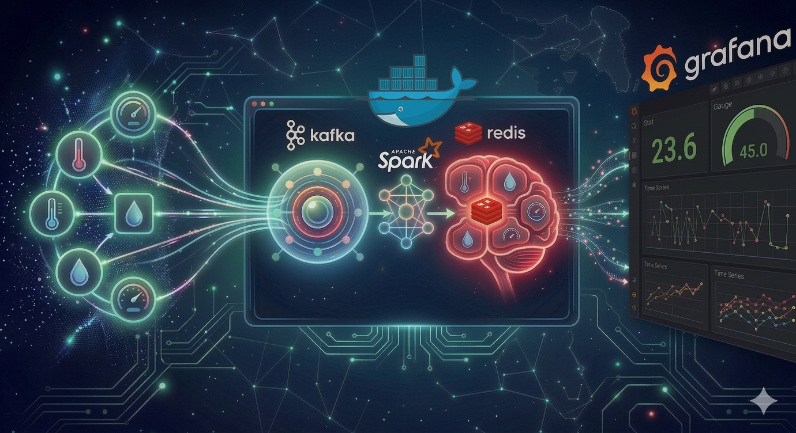
</p>

# Real-Time Telemetry Pipeline

<p align="center">
  <a href="https://github.com/theofanis-tsakanikas/realtime-telemetry-pipeline/actions/workflows/ci.yml"></a>
  <a href="./LICENSE"></a>
  
  
  <br>
  
  
  
  
  
  
  <br>
  
  
  
  
</p>

**A streaming pipeline that catches the sensor failure a threshold filter cannot see — a reading
that is still inside its valid range and quietly wrong.**
*Kafka · Avro + Schema Registry · Spark Structured Streaming · Redis TimeSeries · BigQuery · dbt · Grafana · GKE Autopilot · Terraform*

> This is the **GCP** half of a multi-cloud portfolio. Its companion,
> [`contract-driven-data-pipeline`](https://github.com/theofanis-tsakanikas/contract-driven-data-pipeline),
> applies the same keyless philosophy on **AWS**.

---

## The problem

Every data-quality pipeline catches the obvious failure: a null, a string where a number belongs, a
pressure reading of 2500 hPa. Those are easy — a range filter finds them and a dead-letter queue
keeps them.

The failure that costs money is the one that passes. A sensor drifts 5 °C high after a knock or a
recalibration, and **every single reading it emits is still inside the valid range**. Nothing is
rejected. No alert fires. The dashboards look healthy, the analytics are quietly wrong, and the
problem surfaces weeks later as a decision nobody can explain.

This pipeline treats that as the interesting case. Beyond the range filter, each micro-batch's
per-metric mean is z-tested against the sensor's commissioning baseline — so a fleet reading
plausibly but consistently high raises a **3σ Slack alert** while every individual value still looks
fine.

## Status

The full stack runs two ways from one codebase: locally on Docker Compose for development and the
test suite, and on **GKE Autopilot** in GCP — 100% Terraform, deployed by GitHub Actions with
**Workload Identity Federation**, with no service-account key anywhere. It is designed to be
ephemeral: deploy for a demo, then tear the app layer down.

Here is the moment the whole project exists for. A sensor's drift z-score erupts to **5.5σ**, crosses
the 3σ control limit, and the provisioned alert rule flips to **Firing** — while every reading it
produced was still *inside* its valid range:

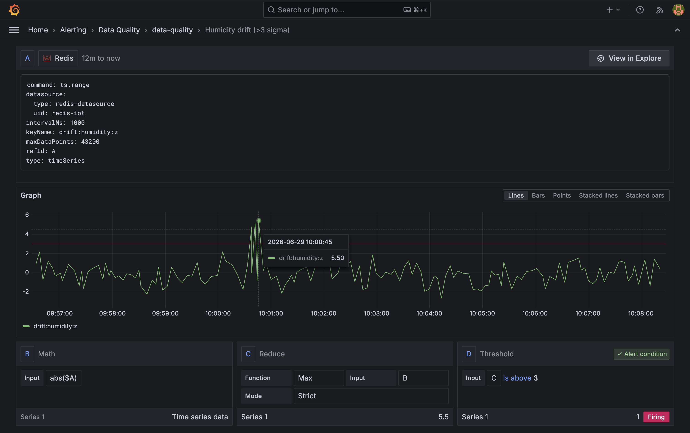

<sub><b>Silent drift, caught</b> — the range filter rejected nothing, because there was nothing out of range to reject. Only the statistical comparison against the commissioning baseline gave it away.</sub>

A single declared data contract ([`scripts/metrics_spec.py`](scripts/metrics_spec.py)) is the source
of truth for the validation ranges, the dead-letter routing **and** the drift baselines — the same
numbers guard every stage, so they cannot disagree.

---

## Contents

| | |
|---|---|
| **[Architecture](#architecture)** | Producer → broker → stream processor → two sinks → dashboards |
| **[The live pipeline](#the-live-pipeline)** | Kafka with Avro, Spark, Redis TimeSeries, Grafana — stage by stage |
| **[Data quality and drift](#data-quality-and-drift)** | The dead-letter queue, and the z-test a threshold cannot replace |
| **[Analytics — BigQuery and dbt](#analytics--bigquery-and-dbt)** | Landing tables into tested marts, refreshed in-cluster |
| **[Cloud-native deployment](#cloud-native-deployment)** | Two Terraform layers, keyless end to end, a private control plane |
| **[Local development](#local-development)** · **[Quickstart](#quickstart)** | Docker Compose, and the Makefile front door |
| **[Testing](#testing)** · **[Repository layout](#repository-layout)** | What the 102 tests cover and what they do not |
| **[What this does not do](#what-this-does-not-do)** · **[Cost](#cost)** | The honest limits, and how the bill returns to near zero |
| **[Docs](#docs)** · **[Security](#security)** · **[License](#license)** | |

---

## Architecture

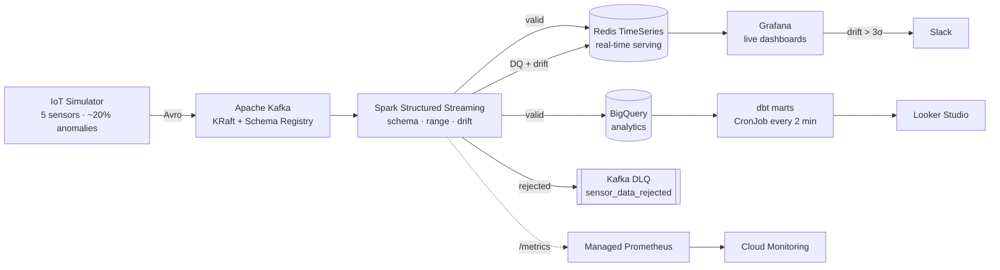
```mermaid
flowchart LR
  SIM["IoT Simulator<br/>5 sensors · ~20% anomalies"] -->|Avro| K["Apache Kafka<br/>KRaft + Schema Registry"]
  K --> SP["Spark Structured Streaming<br/>schema · range · drift"]
  SP -->|valid| R[("Redis TimeSeries<br/>real-time serving")]
  SP -->|valid| BQ[("BigQuery<br/>analytics")]
  SP -->|rejected| DLQ[["Kafka DLQ<br/>sensor_data_rejected"]]
  SP -->|DQ + drift| R
  R --> G["Grafana<br/>live dashboards"]
  BQ --> DBT["dbt marts<br/>CronJob every 2 min"]
  DBT --> LS["Looker Studio"]
  SP -. /metrics .-> GMP["Managed Prometheus"] --> CM["Cloud Monitoring"]
  G -->|"drift > 3σ"| SLACK["Slack"]
```

The shape worth noticing is the **dual sink**: the same validated stream lands in Redis for
sub-second serving and in BigQuery for analytics — the classic hot/cold split, written from one job.
The BigQuery write is deliberately best-effort inside `foreachBatch`: its errors are logged, never
raised, because **analytics must not be able to take down ingestion**.

---

## The live pipeline

### Kafka — schema-governed ingestion

Readings are **Avro-encoded** on the wire and governed by a Confluent **Schema Registry**, so the
contract is enforced at the broker rather than hoped for in the consumer.

<table>
<tr>
<td width="50%">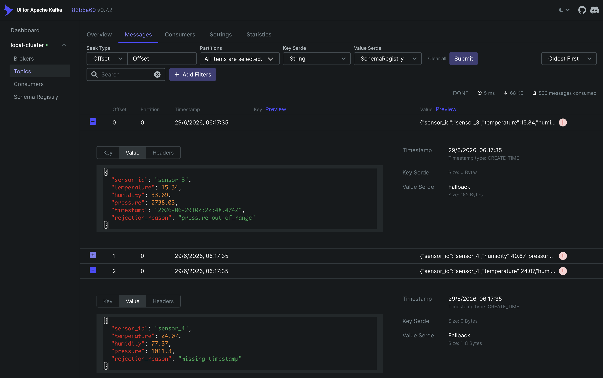<br><sub><b>The topic</b> — Avro-encoded readings on <code>sensor_data</code>, browsable in Kafka-UI. Note the <code>SchemaRegistry</code> value serde: these are not JSON blobs.</sub></td>
<td width="50%">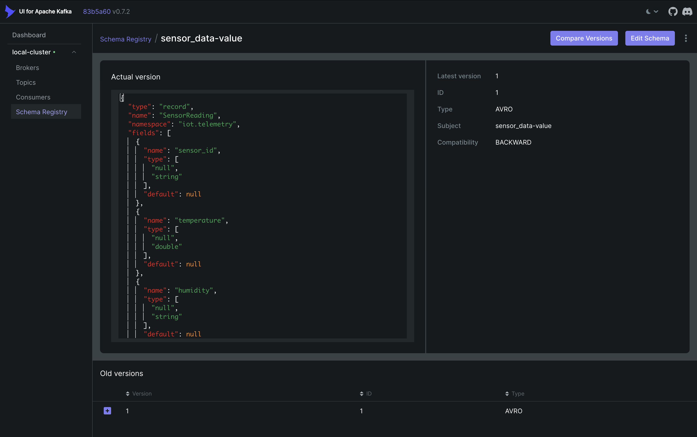<br><sub><b>The contract</b> — the registered <code>SensorReading</code> schema that governs them. A producer that violates it is rejected before a consumer ever sees the message.</sub></td>
</tr>
</table>

<table>
<tr>
<td width="50%"><br><sub><b>Nothing is dropped</b> — readings that fail validation are quarantined to <code>sensor_data_rejected</code>, each tagged with its <code>rejection_reason</code> (<code>invalid_humidity</code>, <code>pressure_out_of_range</code>, …). Inspectable, not lost.</sub></td>
<td width="50%">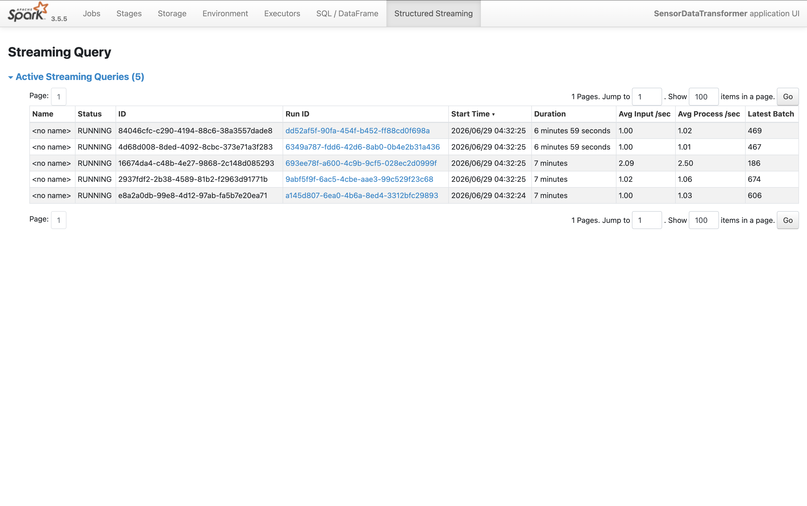<br><sub><b>What processes them</b> — the Spark UI's Structured Streaming tab: active queries, input and processing rates, and the latest batch IDs.</sub></td>
</tr>
</table>

The transform ([`scripts/spark_transform.py`](scripts/spark_transform.py)) does more than move data:
payloads are deserialised against the registered Avro schema so types are fixed at the edge; messy
string fields are regex-validated before casting; out-of-range hardware readings are filtered
(temperature 10–45 °C, humidity 0–100 %, pressure 950–1050 hPa); and the Redis sink opens **one
pipelined connection per Spark partition** via `.foreachPartition()`, pushing native `TS.ADD`
commands with no ORM in the path.

### Redis TimeSeries — the hot path

<table>
<tr>
<td width="50%">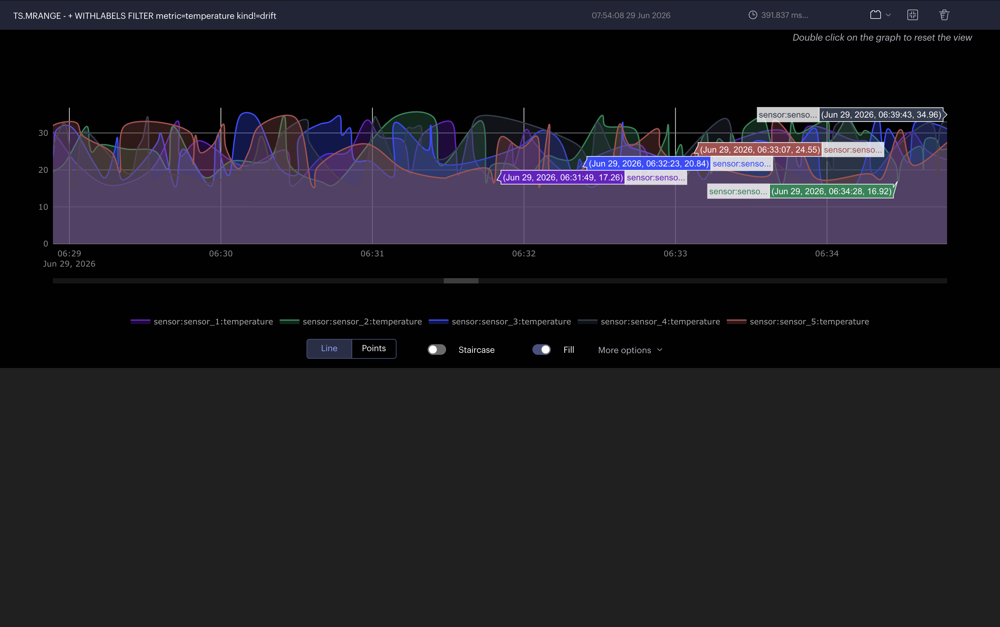<br><sub><b>The serving store</b> — <code>TS.MRANGE</code> across all five sensors' temperature, charted in RedisInsight. This is what Grafana reads.</sub></td>
<td width="50%">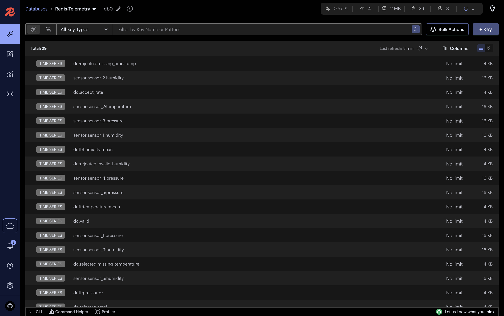<br><sub><b>Underneath</b> — 15 labelled series (5 sensors × 3 metrics) alongside the <code>dq:*</code> and <code>drift:*</code> observability series the job publishes on every batch.</sub></td>
</tr>
</table>

Series carry labels rather than encoding everything in the key, so a dashboard filters by `metric`
or `sensor_id` without string surgery, and `TS.ADD ... ON_DUPLICATE LAST` makes a replay idempotent.

---

## Data quality and drift

Observability here is a **first-class output of the pipeline**, not a wrapper around it. A third
sink publishes per-batch accept rate, rejections by reason, and per-metric drift z-scores to Redis
on every micro-batch.

<table>
<tr>
<td width="50%">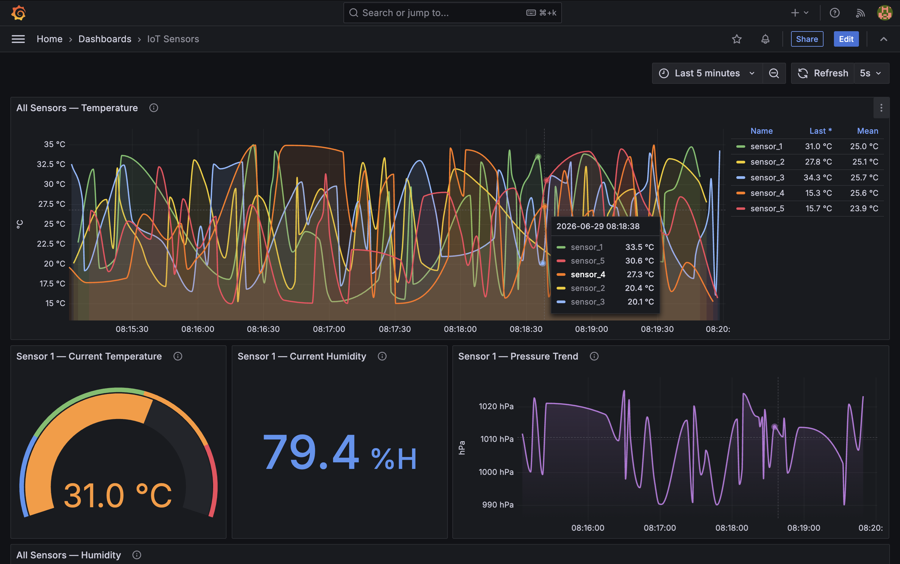<br><sub><b>The readings</b> — all-sensor temperature and humidity, Sensor 1's live gauges and pressure trend, refreshing every 5 seconds.</sub></td>
<td width="50%">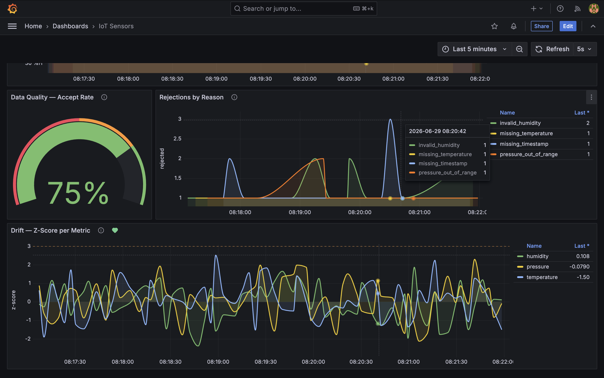<br><sub><b>The quality of those readings</b> — accept rate, rejections broken down by reason, and the per-metric drift z-score with its 3σ band. You can <i>see</i> data quality rather than trust it.</sub></td>
</tr>
</table>

When the z-score crosses the band, the alert rule fires and posts to Slack — with a matching
**resolved** message when it clears, so the channel does not fill with stale alarms:

<table>
<tr>
<td width="50%">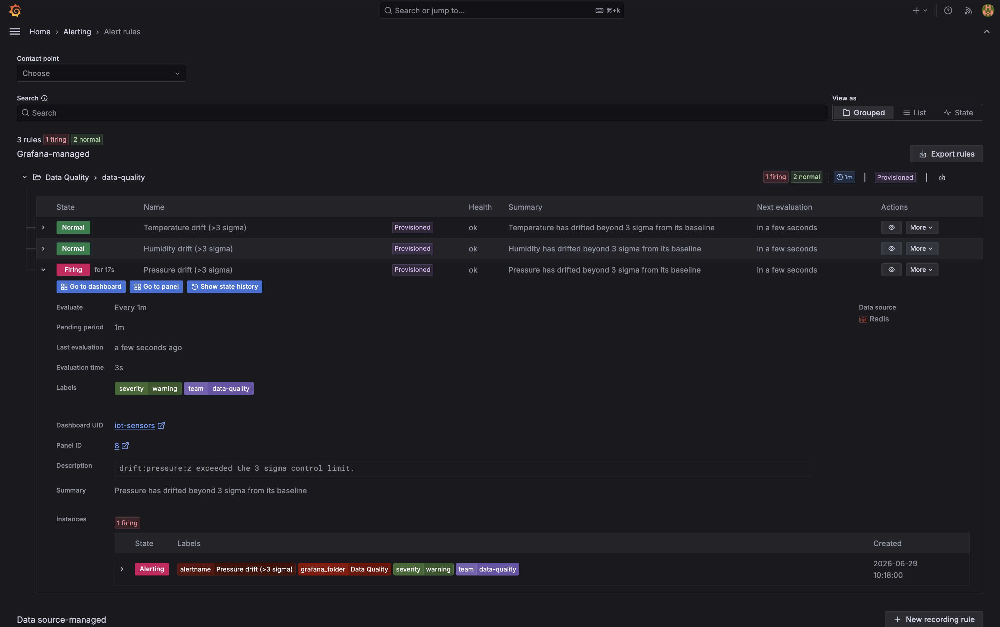<br><sub><b>In Grafana</b> — the provisioned rule's condition (<code>abs(z) is above 3</code>) flips to <b>Firing</b>. The rule is code, in <code>infra/grafana/provisioning/alerting/</code>, not a click.</sub></td>
<td width="50%">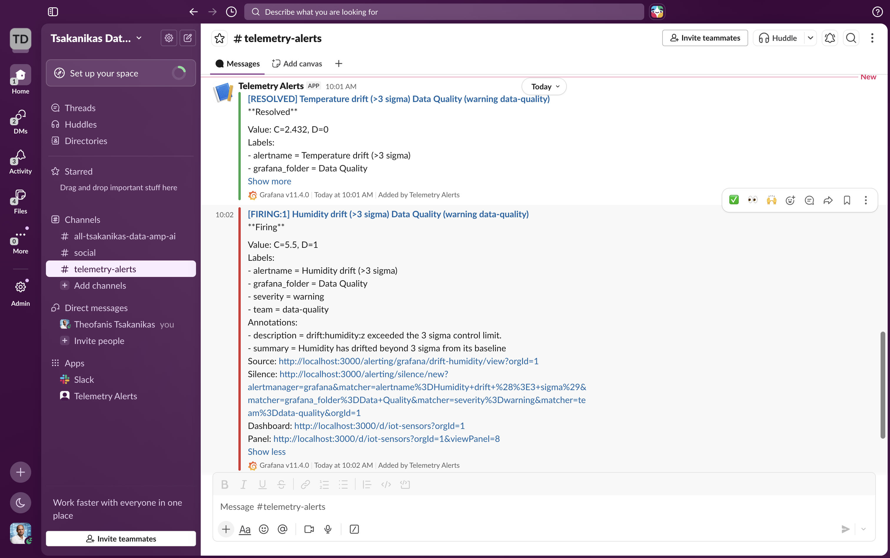<br><sub><b>In Slack</b> — the notification that reaches a human, naming the metric and the sensor that drifted.</sub></td>
</tr>
</table>

Alongside the business-level signal, the Spark driver exposes Prometheus metrics: in the cloud, **GKE
Managed Service for Prometheus** scrapes them into Cloud Monitoring, where streaming throughput,
micro-batch latency and JVM heap/GC are queryable. Locally, a self-hosted Prometheus backs the same
**Pipeline Health** dashboard.

---

## Analytics — BigQuery and dbt

The streaming job lands two raw tables (`telemetry.readings`, `telemetry.rejections`,
day-partitioned with a 30-day expiry). **dbt** turns them into clean, tested marts — six models
across a staging and a marts layer:

| Layer | Models |
|---|---|
| **Staging** | `stg_readings`, `stg_rejections` — typed, renamed views over the raw landing tables |
| **Marts** | `sensor_minutely`, `accept_rate_minutely`, `rejections_by_reason`, `reading_volume` |

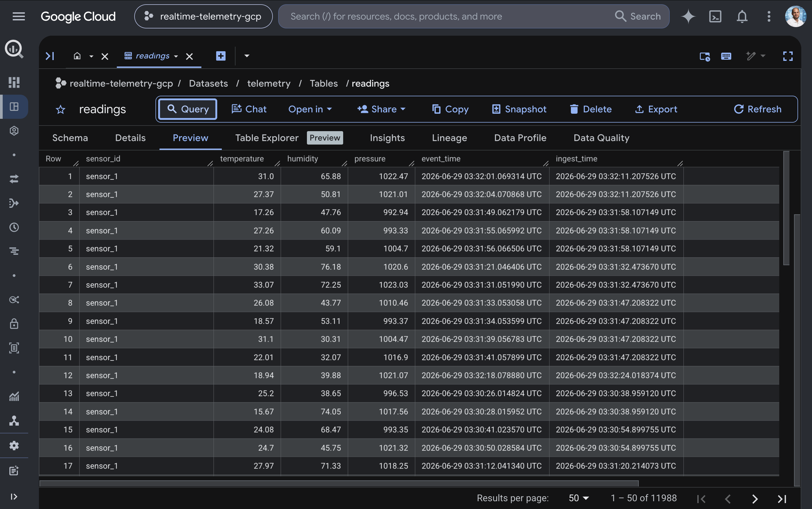

<sub><b>The cold path</b> — the raw landing table in BigQuery, day-partitioned with a 30-day expiry so the demo does not accumulate cost. In the cloud a Kubernetes <b>CronJob runs <code>dbt build</code> every 2 minutes</b>, so the marts track the live stream; Looker Studio sits on top.</sub>

---

## Cloud-native deployment

The stack deploys to GCP as a cloud-native application — **GKE Autopilot**, provisioned with
Terraform, shipped by GitHub Actions, with **no service-account keys anywhere**.

### Two Terraform layers, two lifecycles

| Layer | Lifecycle | Provisions |
|---|---|---|
| **`foundation/`** | Run **once** by the owner (`make bootstrap`); persists | Workload Identity Federation, deployer + runtime service accounts, Secret Manager (values seeded from `.env`), Artifact Registry, **BigQuery** dataset + tables, monitoring |
| **`app/`** | Routine, CI- or CLI-deployable; **ephemeral** | VPC + Cloud NAT, **GKE Autopilot** (private control plane), fleet membership, the pod-level Workload Identity binding |

The split is the cost control: the foundation costs ~cents idle, the GKE workloads are the only real
spend, and one action destroys them.

**Keyless end to end.** GitHub Actions authenticates to GCP via **Workload Identity Federation**
(OIDC, with an attribute condition pinned to this repository). Pods authenticate to Google APIs via
**Workload Identity**. `kubectl` reaches a **private** control plane — private nodes *and* a private
endpoint — through **Connect Gateway**: no bastion, no public endpoint, no keys. Secrets are pulled
from Secret Manager through the GKE-managed **Secrets Store CSI** provider and materialised as a
Kubernetes Secret when the first pod mounts them, so no credential is written into a manifest.

### The three steps

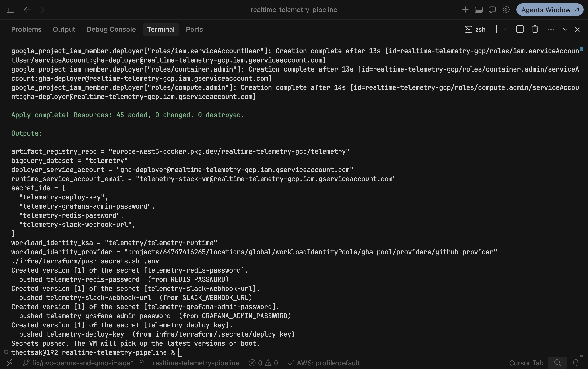

<sub><b>Step 1 · <code>make bootstrap</code></b> (owner, once) — applies the foundation and seeds the secret <i>values</i> from your local <code>.env</code> into Secret Manager. One command for the whole identity, secrets, registry and BigQuery base.</sub>

<table>
<tr>
<td width="50%">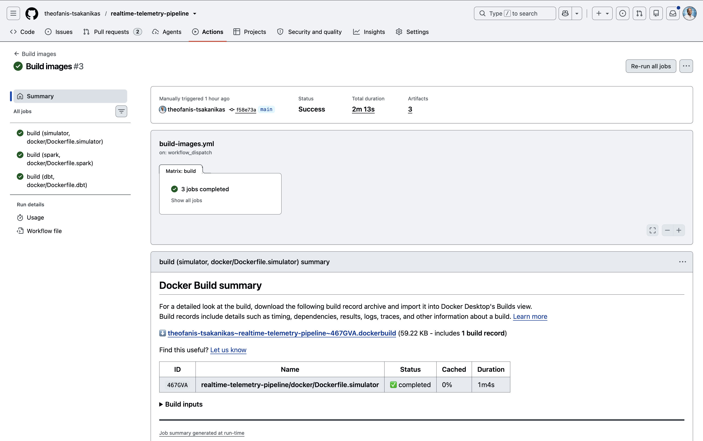<br><sub><b>Step 2 · build and push</b> — the simulator, Spark and dbt images go to Artifact Registry on every relevant push, tagged <code>:sha</code> and <code>:latest</code>.</sub></td>
<td width="50%">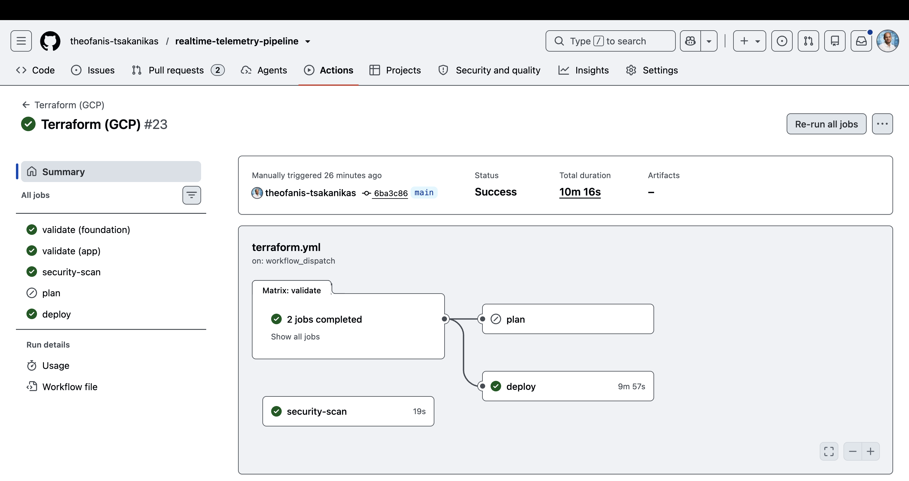<br><sub><b>Step 3 · one-button deploy</b> — a <code>workflow_dispatch</code> that applies the app layer and then deploys the Kubernetes manifests through Connect Gateway.</sub></td>
</tr>
</table>

<table>
<tr>
<td width="50%">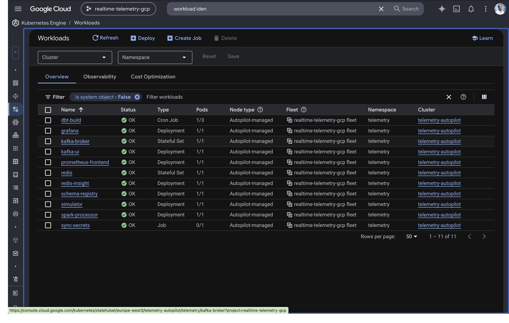<br><sub><b>The result</b> — the full pipeline running as pods on GKE Autopilot: simulator, Spark processor, Redis, Grafana and the dbt CronJob.</sub></td>
<td width="50%">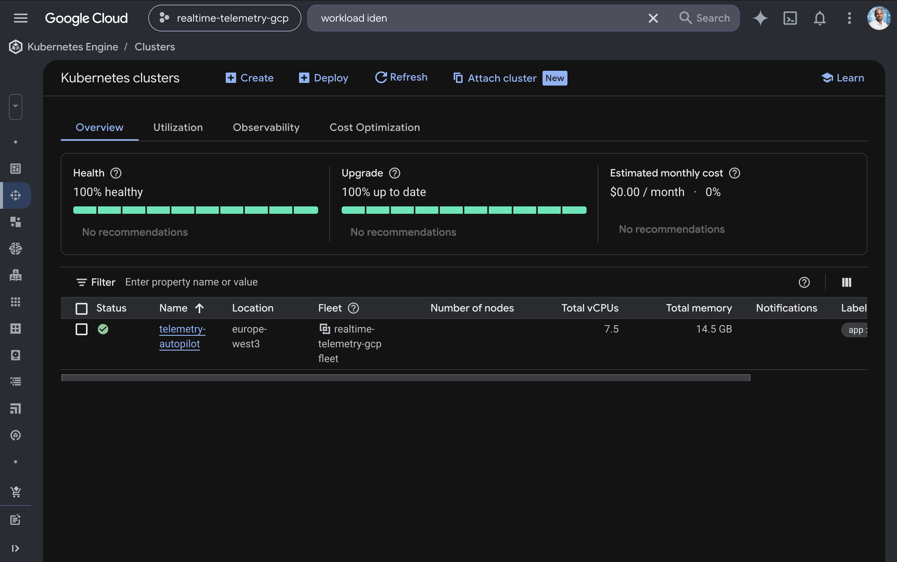<br><sub><b>On a private cluster</b> — Autopilot, private nodes and a private control plane. Google manages the nodes; pods request CPU and memory directly.</sub></td>
</tr>
</table>

### The GCP footprint

<table>
  <tr>
    <td align="center">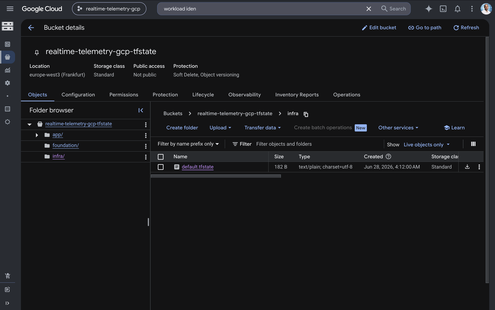<br><sub>GCS — Terraform remote state</sub></td>
    <td align="center">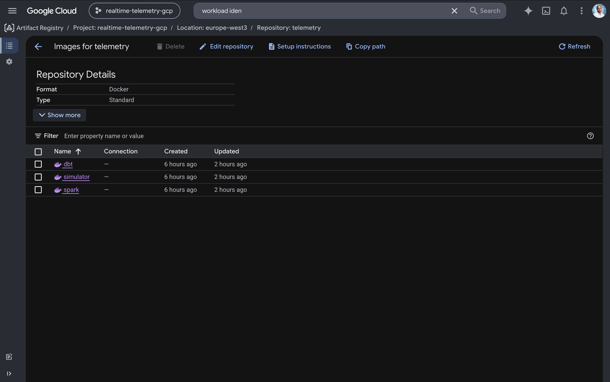<br><sub>Artifact Registry — the three images</sub></td>
  </tr>
  <tr>
    <td align="center">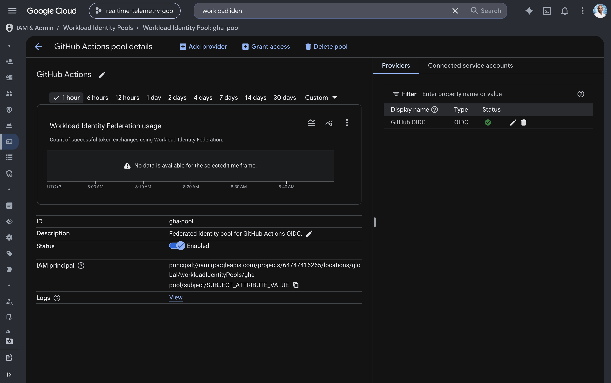<br><sub>Workload Identity Federation — keyless CI</sub></td>
    <td align="center">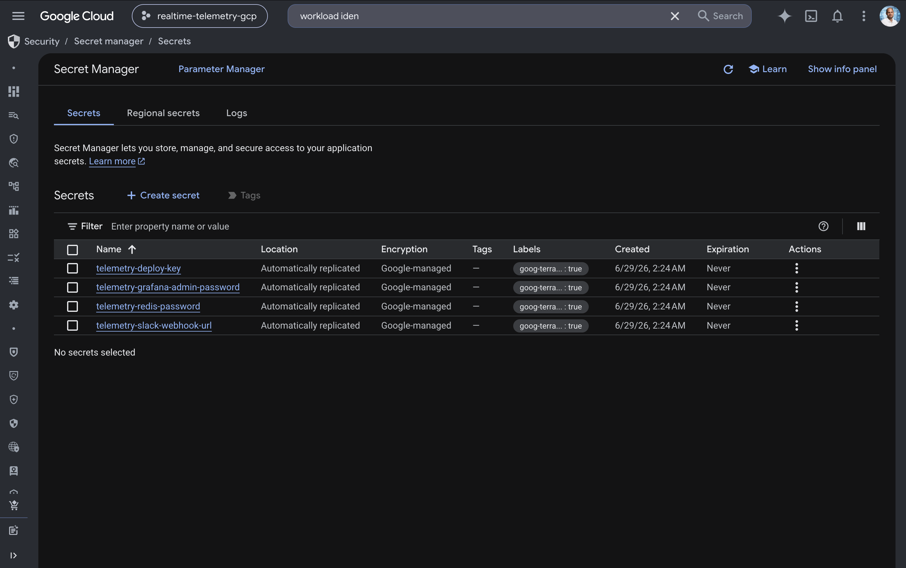<br><sub>Secret Manager — values, never in git</sub></td>
  </tr>
  <tr>
    <td align="center">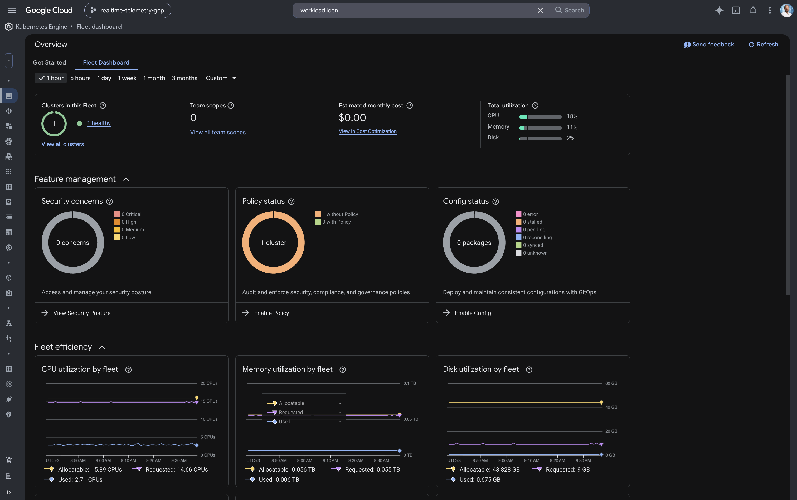<br><sub>GKE Fleet — one cluster, healthy</sub></td>
    <td align="center">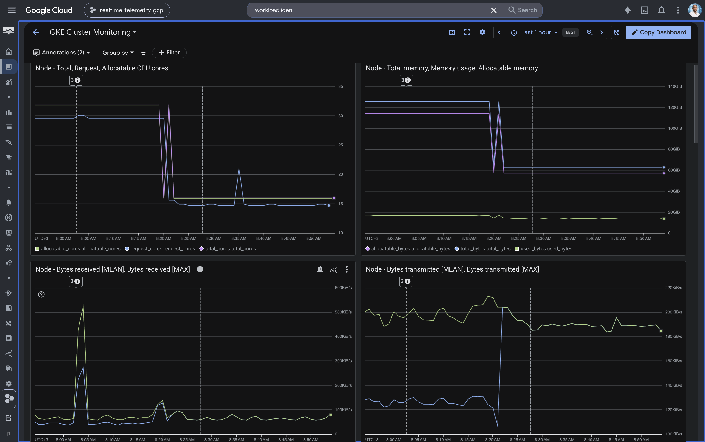<br><sub>Cloud Monitoring (GMP) dashboards</sub></td>
  </tr>
</table>

<sub>The footprint, as a contact sheet — every one of these is created by <code>terraform apply</code>, not by clicking.</sub>

---

## Local development

The full **streaming** stack runs on Docker Compose — ideal for development and for running the test
suite with no cloud at all. *(The BigQuery + dbt analytics layer is cloud-only: dbt-bigquery targets
managed BigQuery, so there is no local warehouse.)*

## Quickstart

```bash
# 1. One-time setup: venv, deps, data dirs, and a .env from the template
chmod +x setup.sh run.sh && ./setup.sh

# 2. Build the custom simulator + Spark images
make build

# 3. Start the full stack (Kafka, Spark, Redis, Grafana, Kafka-UI, RedisInsight)
make start

# 4. Verify, stream logs, tear down
make ps | logs | stop
```

Then open **Grafana** at `http://localhost:3000` — the Redis datasource and both dashboards are
auto-provisioned. Full service URLs and ports are in [CLAUDE.md](./CLAUDE.md).

**In the cloud**, the Makefile is the same front door:

```bash
make bootstrap      # ONE-TIME: foundation apply + seed secrets from .env (owner)
make k8s-images     # build + push simulator / spark / dbt images
make cloud-up       # terraform apply the app layer (VPC + NAT + GKE Autopilot)
make k8s-kubeconfig # point kubectl at the private cluster via Connect Gateway
make k8s-apply      # deploy the Kubernetes manifests
make cloud-down     # destroy the app layer → ~$0 (foundation + BigQuery + secrets persist)
```

Routine deploys and destroys also run from the **GitHub Actions** UI (keyless), so you never need
credentials on your laptop.

---

## Testing

**102 tests** covering the transformation and observability logic in isolation — **no Kafka, no
Redis, no Spark cluster, no Docker**. They run against a local `SparkSession` (session-scoped
fixture) and a mocked Redis client, so the suite is fast and CI-friendly.

```bash
source .venv/bin/activate
make test        # pytest — the full suite
make coverage    # with a coverage report (terminal + htmlcov/)
make lint        # ruff over scripts/, tests/, app/
```

| Area | What is asserted |
|---|---|
| `clean_data()` | Range and boundary filtering, regex humidity casting, schema enforcement via `from_json` |
| `rejected_data()` | Every rejection reason — and that valid + rejected **exactly partition** the input |
| Data quality | Per-batch accept rate and rejection breakdown |
| Drift | Z-score against baseline, the alert threshold, and empty/degenerate batches |
| Redis sink | Key scheme, ms conversion, idempotent `TS.ADD` arguments (mocked client) |
| Simulator | Message schema, the ~20% anomaly rate per type, deterministic-by-seed output |
| Streamlit app | Demo synthesis, banding, pivots, and a **contract-drift guard** asserting the app's ranges still match `metrics_spec.py` |

**99 of the 102 run by default.** The other three are marked `integration` and deselected in
`pyproject.toml` because they need a Docker daemon — run them deliberately with `pytest -m
integration`.

CI ([`.github/workflows/ci.yml`](.github/workflows/ci.yml)) runs **four** gates on every push and
pull request, not just the unit tests: `lint-and-test`, `compose-validate` (the local stack's
Compose file parses and resolves), `dbt-validate` (the models compile) and `k8s-validate` (the
Kustomize manifests build). Together they mean a broken manifest or a broken dbt model fails the
pull request rather than the deploy.

**What the tests do not cover:** anything that needs the cloud. There is no test that a Terraform
plan is correct, that Workload Identity actually binds, or that the Secrets Store CSI provider
materialises the secret — those are proven by the screenshots above, from real runs, not by
assertions in CI.

---

## Repository layout

| Path | Purpose |
|---|---|
| [`scripts/`](scripts/) | The pipeline: simulator, **`metrics_spec.py`** (the contract — ranges *and* drift baselines), data-quality metrics, drift detector, and the Spark job |
| [`dbt/`](dbt/) | Six models — staging views over the raw landing tables, four BigQuery marts, with tests |
| [`docker/`](docker/) | Three images: the simulator, the PySpark job (+ Kafka/Avro/BigQuery connectors), and the dbt-bigquery CronJob runner |
| [`infra/docker-compose.yml`](infra/docker-compose.yml) | The local stack — Kafka in KRaft mode, no Zookeeper |
| [`infra/grafana/`](infra/grafana/) | Provisioned datasource, two dashboards, and the Slack alerting rules — all as code |
| [`infra/k8s/base/`](infra/k8s/base/) | Kustomize manifests for the whole GKE stack, including the Secrets Store CSI wiring |
| [`infra/terraform/foundation/`](infra/terraform/foundation/) | Persistent: WIF, service accounts, Secret Manager, Artifact Registry, BigQuery |
| [`infra/terraform/app/`](infra/terraform/app/) | Ephemeral: VPC, NAT, GKE Autopilot, fleet, the Workload Identity binding |
| [`app/`](app/) | Streamlit "Sensor Wall" — standalone deployable |
| [`tests/`](tests/) | 102 tests — pure logic, no containers |

---

## What this does not do

- **The data source is a simulator.** Five synthetic sensors with a deliberate ~20% anomaly rate.
  Real device telemetry (an MQTT bridge or Kafka Connect) would use the same contract, cleaning and
  observability — but no real hardware has ever fed this pipeline, and the drift baselines are
  commissioning values chosen for the demo rather than measured from a fleet.
- **Single Kafka broker, single Spark driver.** KRaft with `replication-factor=1` and one driver.
  There is no high availability here: ≥3 brokers with `min.insync.replicas=2` and Spark across
  multiple executors (or Dataproc) is what production would need, and none of it is demonstrated.
- **The drift detector is a z-test against a static baseline.** It catches a shift in the mean. It
  does not catch a change in variance, a stuck sensor repeating one plausible value, or a slow ramp
  that moves the baseline with it. Nothing recalibrates the baseline automatically.
- **Drift is detected, never acted upon.** The alert reaches Slack. No run fails, no sensor is
  quarantined, nothing downstream is held back.
- **The WIF attribute condition is scoped to the repository, not to a branch or environment.** Any
  workflow in this repository can federate. See [SECURITY.md](SECURITY.md).
- **The dbt marts are refreshed on a 2-minute CronJob, not incrementally.** At this data size that
  is fine; at scale the models would need to be incremental with partition pruning, and dbt CI checks
  on the marts.
- **The analytics layer is cloud-only.** `dbt-bigquery` targets managed BigQuery, so the local
  Docker stack covers streaming and observability but not the marts.

---

## Cost

**Designed to be ephemeral, and that is the cost control.** The persistent `foundation/` layer —
identity, secrets, Artifact Registry, the BigQuery dataset — costs approximately cents while idle.
The GKE Autopilot workloads are the only real spend, and `make cloud-down` (or the destroy action)
removes them.

BigQuery keeps the bill bounded on its own: both landing tables are **day-partitioned with a 30-day
expiry**, so the demo cannot accumulate storage indefinitely. The local Docker stack costs nothing
beyond the ~8 GB of RAM it wants.

There is no always-on cluster in the design. Between demos, the standing cost is the foundation and
whatever is left in BigQuery and Artifact Registry.

---

## Docs

[CLAUDE.md](./CLAUDE.md) — the engineering reference: service ports, the end-to-end data flow, test
coverage and known failure modes ·
[infra/terraform/README](infra/terraform/README.md) — the two layers and the bootstrap ·
[docs/looker-studio.md](docs/looker-studio.md) · [CHANGELOG](CHANGELOG.md)

## Security

What is hardened, the known limitations, and what a real deployment would do instead:
[SECURITY.md](SECURITY.md). The short version — no service-account key exists anywhere: CI federates
through Workload Identity Federation, pods through Workload Identity, and secrets are pulled from
Secret Manager through the CSI provider rather than written into a manifest. The GKE control plane is
private, reachable only through Connect Gateway, and gitleaks scans the full history on every push.

## License

[MIT](./LICENSE) © 2026 Theofanis Tsakanikas
